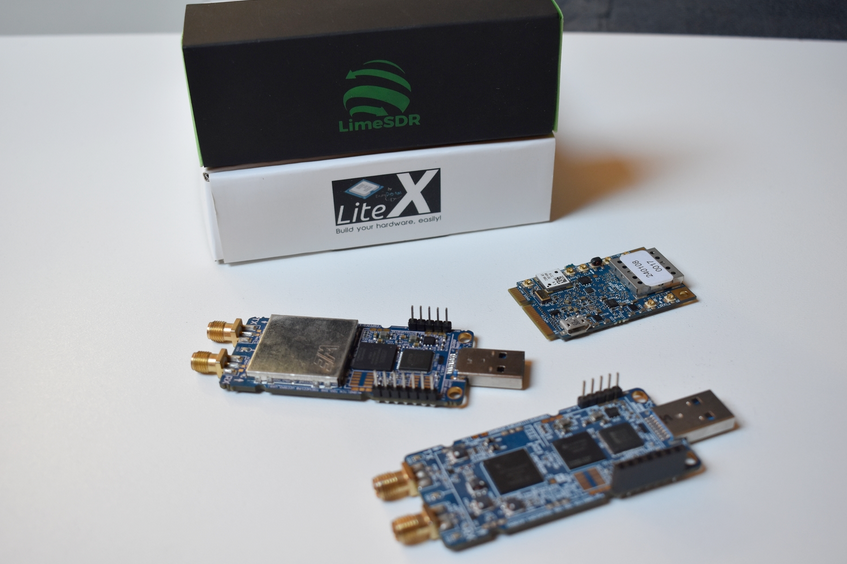
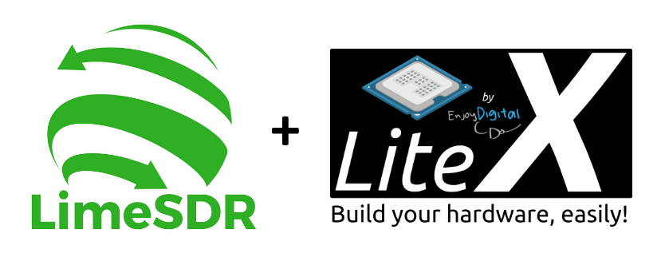
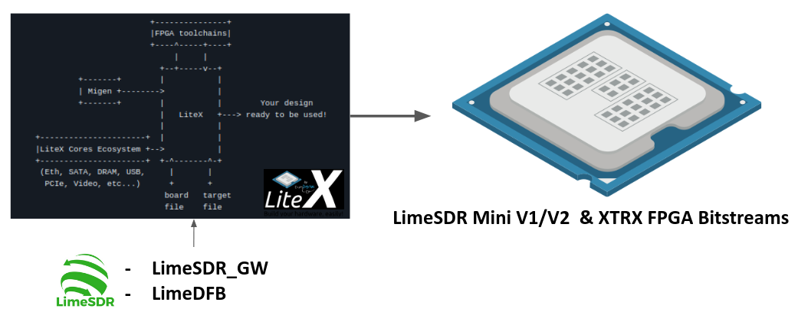
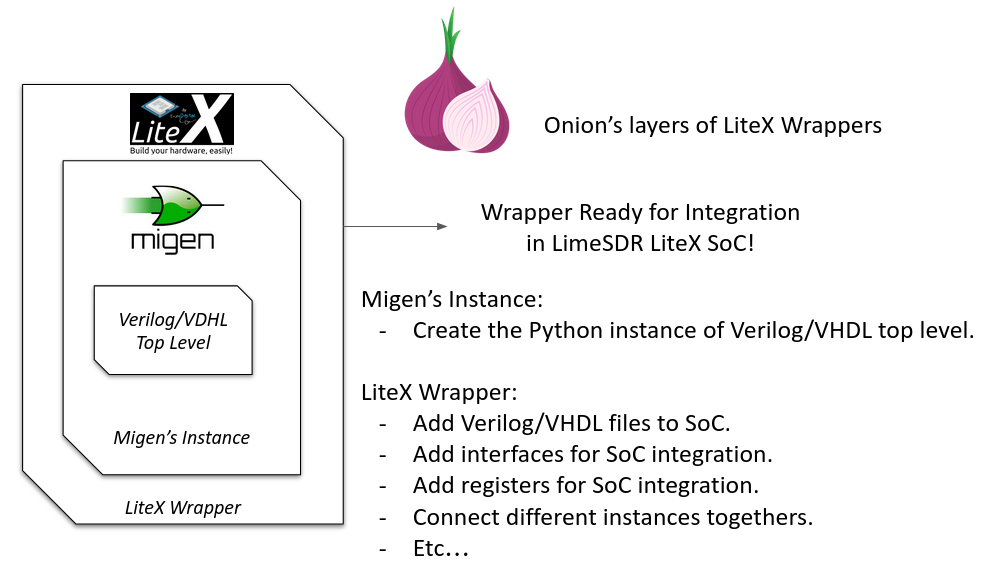
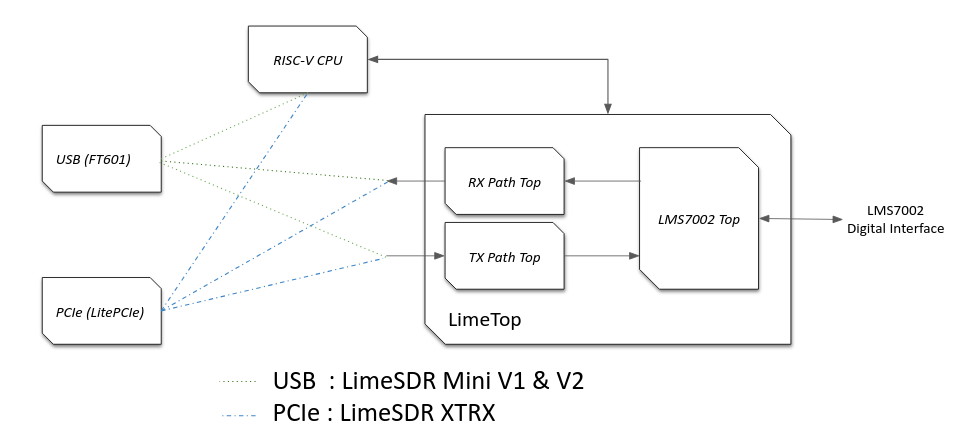
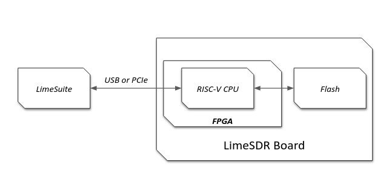

Adding a New Board
==================

This guide is tailored for FPGA and RF engineers looking to extend the **LimeSDR_GW** repository (available on GitHub at myriadrf/LimeSDR_GW) for custom SDR platforms or to add support for new boards. It introduces the **LiteX** framework, the backbone of the repository, which uses Python for hardware system description and integration. Unlike conventional HDL-centric processes, LiteX automates routine SoC tasks, allowing a greater focus on system architecture and RF functionalities.

The LimeSDR_GW project brings together various SDR board designs in a portable, unified gateware ecosystem. By integrating LiteX with modular RF processing modules from **LimeDFB**, it simplifies maintenance, expansion, and adaptation across diverse FPGA architectures and hardware configurations. For instance, you might use this guide to incorporate an alternative RF transceiver, switch to a different FPGA vendor for cost savings, or prototype an SDR for applications such as 5G research or satellite communication.

This document outlines the process for adapting new boards, including repository organization, key LiteX concepts, and integration of elements like PCIe or USB interfaces. It assumes familiarity with FPGA workflows (synthesis, timing analysis, simulation) and basic Python proficiency.

If anything remains unclear, please submit an issue on GitHub—contributions and insights are highly encouraged!

.. contents:: Table of Contents
   :depth: 3
   :local:

Introduction
------------

Overview of LiteX and LimeSDR_GW
^^^^^^^^^^^^^^^^^^^^^^^^^^^^^^^^

**LiteX** is an open-source SoC builder toolkit that uses Python to define, integrate, and assemble FPGA-based systems. It automates challenging SoC components, such as bus interconnections, clock/reset management, memory allocation, CPU integration, and firmware/toolchain compilation.

Unlike traditional HDL methods or proprietary tools like Vivado's Block Design, LiteX offers a flexible, vendor-neutral workflow that seamlessly connects hardware and software.

Core features include:

- **Hardware Integration**: Connects modules, manages clock/reset domains, and handles system buses with minimal overhead.
- **CPU and Firmware Support**: Supports various soft-core processors (e.g., VexRiscv, LM32) and automates firmware builds (including linker scripts and BIOS).
- **Toolchain Automation**: Handles firmware and FPGA compilation pipelines—running synthesis, placement/routing, bitstream generation, and firmware builds with simple commands.
- **Vendor Neutrality**: Works with Intel, Xilinx, Lattice, and others through adaptable platform definitions.
- **Multi-Language Support**: Easily incorporates existing Verilog/VHDL components via wrappers.

The **LimeSDR_GW** repository uses LiteX to provide a consolidated gateware base for LimeSDR variants (e.g., Mini V1/V2, XTRX). It replaces scattered HDL projects with a systematic, sustainable LiteX-based SoC for SDR applications.

It incorporates the **LimeDFB** library (hosted on GitHub at myriadrf/LimeDFB), featuring modular VHDL components for RF data processing (e.g., RX/TX paths for the LMS7002M). These modules are reusable and adaptable for other RF transceivers.

Advantages of the LimeSDR_GW and LimeDFB approach include:

- **Reusability**: Shared RF and interface components (e.g., streaming engines, LMS7002M controllers) across all boards.
- **Sustainability**: A single, uniform architecture replaces fragmented per-board HDL branches.
- **Modularity**: Clear separation of RF processing (LimeDFB), SoC management (LiteX), and board-specific configs (platform/target).
- **Expandability**: Easy addition of new boards or variants by extending platform/target files, without duplicating logic.
- **Portability**: Greater flexibility for migrating to new FPGA families or upcoming LimeSDR versions.
- **Collaboration**: Standardized designs improve readability and reduce onboarding challenges for contributors.

This approach replaces isolated, board-specific HDL projects with a unified, scalable framework that accelerates innovation while reducing technical debt.

Benefits of Using LiteX (in the Context of LimeSDR_GW)
^^^^^^^^^^^^^^^^^^^^^^^^^^^^^^^^^^^^^^^^^^^^^^^^^^^^^^

LiteX delivers substantial improvements to SDR gateware development within the LimeSDR_GW ecosystem:

- **Unified SoC Framework**: Platforms like Mini V1/V2 and XTRX share a common blueprint, facilitating maintenance and consistent features across configurations.
- **Streamlined Board Setup**: Python-based platform and target scripts quickly define clocks, pin assignments, and memory layouts, eliminating custom HDL top-level files.
- **Reusable Host Interfaces**: PCIe and USB modules are modularized for reuse, minimizing redundant work.
- **Seamless Firmware Pipeline**: Integrating a soft CPU (e.g., VexRiscv or PicoRV32) requires minimal Python code, with LiteX handling firmware compilation, linker files, and deployment automatically.
- **Fast Prototyping Cycles**: Simultaneous hardware and software modifications in a single environment speed up development and debugging.
- **Cross-FPGA Portability**: Designs can be ported to different FPGA vendors (Xilinx, Intel, Lattice) by simply updating the platform definition and making minor vendor-specific adjustments.
- **Open Toolchain Support**: LiteX integrates with open-source FPGA tools (e.g., Yosys, Nextpnr) where possible, enabling fully transparent development workflows.

Before LiteX, LimeSDR boards used separate HDL projects dependent on vendor-specific tools. Processor choices varied: MicroBlaze for Xilinx, Nios II for Intel, and LM32 for Lattice. Each had unique firmware toolchains, memory maps, diagnostics, and flashing methods. Switching boards required adapting to different environments, hindering code sharing and debugging consistency.

The LiteX-based LimeSDR_GW overcomes this fragmentation with a shared SoC structure, standardized firmware management, and unified debugging tools. This greatly lowers barriers for adding new boards or features, making development, validation, and collaboration far more efficient.

What This Guide Covers
^^^^^^^^^^^^^^^^^^^^^^

This guide provides a complete walkthrough for adding a new board to the LimeSDR_GW framework using LiteX:

- Understanding key LiteX concepts: boards, platforms, targets
- Navigating the LimeSDR_GW and LimeDFB repository structures
- Creating a new platform and target for your hardware
- Integrating RF features using LimeDFB or custom HDL modules
- Setting up host connectivity via PCIe or USB
- Adding a soft CPU for control and diagnostics
- Generating and deploying gateware with open or proprietary tools
- Debugging through basic test setups (e.g., loopback configurations)
- Following best practices for portability, naming, and organization

Upon completion, you'll be equipped to enhance the LimeSDR_GW project with your own hardware and contribute meaningfully to the community.

.. _understanding_litex_boards_platforms_targets:

Understanding Core LiteX Concepts: Boards, Platforms, Targets
-------------------------------------------------------------

LiteX structures FPGA designs around three key concepts: **boards**, **platforms**, and **targets**. Unlike traditional design flows, where these are spread across HDL source files, constraint documents (e.g., `.xdc`, `.sdc`, or `.lpf`), and vendor-specific project settings, LiteX centralizes them in Python scripts. This provides a portable, vendor-neutral, and toolchain-aware method for specifying systems.

This section explains each concept, using the **LimeSDR Mini V2** as a real-world example.

.. figure:: images/limesdr_mini_v2.png
   :width: 600
   :align: center
   :alt: LiteSDR Mini V2

Platform = Board + Constraints
^^^^^^^^^^^^^^^^^^^^^^^^^^^^^^

In LiteX, the platform represents the physical hardware board and its constraints. Rather than scattering pin assignments and timing specs across separate HDL and constraint files, LiteX consolidates them into a single **platform Python file** (e.g., `limesdr_mini_v2_platform.py`).

This file includes:

- Definitions for all available I/Os (clocks, SPI, I2C, LMS7002M interfaces, USB FIFO, LEDs, etc.)
- Electrical characteristics (`IOStandard`, `Misc`, pull-up resistors, etc.)
- Timing constraints via methods like `add_period_constraint()`
- The FPGA device identifier
- Programming interface configuration (`create_programmer`)

LiteX parses this file to generate suitable project and constraint files for tools like Vivado, Quartus, Diamond, or Yosys/Nextpnr.

LMS7002M I/O Block on LimeSDR Mini V2
^^^^^^^^^^^^^^^^^^^^^^^^^^^^^^^^^^^^^

This I/O definition specifies all signals connecting the FPGA to the LMS7002M transceiver, including control lines, RX/TX digital data paths, and clock signals:

.. code-block:: python

    ("LMS", 0,
        # Control.
        Subsignal("RESET",            Pins("A7")),
        Subsignal("CORE_LDO_EN",      Pins("C6")),
        Subsignal("RXEN",             Pins("D6")),
        Subsignal("TXEN",             Pins("B7")),

        # RX Interface (LMS → FPGA).
        Subsignal("DIQ1_D",           Pins("J2 L1 K1 K4 G3 F4 J1 H1 G4 F2 G1 H2")),
        Subsignal("TXNRX1",           Pins("F1")),
        Subsignal("ENABLE_IQSEL1",    Pins("F3")),
        Subsignal("MCLK1",            Pins("H4")),
        Subsignal("FCLK1",            Pins("H3")),

        # TX Interface (FPGA → LMS).
        Subsignal("DIQ2_D",           Pins("A3 C2 A2 B4 C3 B2 D3 B1 A4 C1 C7 A6")),
        Subsignal("TXNRX2_or_CLK_SEL", Pins("B6")),
        Subsignal("ENABLE_IQSEL2",    Pins("C4")),
        Subsignal("MCLK2",            Pins("D2")),
        Subsignal("FCLK2",            Pins("D1")),

        # Electrical standard.
        IOStandard("LVCMOS25")
    ),

This method replaces the conventional spread across a main HDL wrapper and multiple `.xdc`/`.lpf`/`.sdc` files.

Timing Constraints Generation
^^^^^^^^^^^^^^^^^^^^^^^^^^^^^

Main timing constraints related to hardware oscillators are defined programmatically in the platform's `do_finalize()` function:

.. code-block:: python

    def do_finalize(self, fragment):
        self.add_period_constraint(self.lookup_request("LMK_CLK"),   1e9/40e6)
        self.add_period_constraint(self.lookup_request("FT_CLK"),    1e9/100e6)
        self.add_period_constraint(self.lookup_request("LMS:MCLK1"), 1e9/125e6)
        self.add_period_constraint(self.lookup_request("LMS:MCLK2"), 1e9/125e6)

LiteX then translates these into the appropriate format for the selected toolchain:

- `.lpf` for **Diamond**
- `.sdc` for **Nextpnr**
- `.xdc` for **Vivado**
- `.qsf` and `.sdc` for **Quartus**

As created in the user design, other timing constraints can also be added in the target. Timing constraints directly derived from PLLs/MMCMs are generally automatically added by the tools if the source constraint is defined, so there is generally no need to add them manually (The approach can still depend on the toolchain and timing reports need to be verified after build).

Multiple Toolchain Support
^^^^^^^^^^^^^^^^^^^^^^^^^^

Since LiteX uses its own IO and timing constraints definitions and supports multiple toolchains when available for the same FPGA family, switching between toolchains is simply a matter of changing the toolchain argument.

The LimeSDR Mini V2 supports both **Lattice Diamond** and **Yosys + Nextpnr** workflows:

- The same Python platform file is used for both.
- LiteX generates the relevant build artifacts based on the specified toolchain.
- For example:

  - With ``--toolchain=diamond`` → `.ldf`, `.lpf`, VHDL-compatible sources
  - With ``--toolchain=trellis`` → `.json`, `.sdc`, `pcf`

This enables smooth switches between proprietary and open-source toolchains without duplicating designs or constraints.

Target = SoC Top-Level + Flow Control
^^^^^^^^^^^^^^^^^^^^^^^^^^^^^^^^^^^^^

The *target* file (e.g., `limesdr_mini_v2.py`) serves as the main entry point. It manages:

- Instantiation of the platform class
- Initialization of the SoC core
- Connection of peripherals, memory regions, buses, and clock domains
- Integration of logic for the LMS7002M (via `LimeTop`), FT601 USB interface, SPI, I2C, and other components
- Addition of optional features like LiteScope analyzers or UARTBone

The same file can be used to build, load, or test a bitstream with different options:

.. code-block:: bash

    # Open-source toolchain build + load
    python3 -m boards.targets.limesdr_mini_v2 --toolchain=trellis --build --load

    # Diamond toolchain build + flash
    python3 -m boards.targets.limesdr_mini_v2 --toolchain=diamond --build --flash

How It All Fits Together
^^^^^^^^^^^^^^^^^^^^^^^^

- **Platform** = Unified Python representation of board I/O, constraints, and flashing method
- **Target** = Main SoC builder that handles system wiring
- **Toolchain files** = Automatically generated based on the platform and selected toolchain

This structure supports consistent, flexible designs across various LimeSDR boards and FPGA vendors, removing the need to modify underlying HDL or constraint files.

.. _creating_litex_migen_wrappers:

Creating LiteX/Migen Wrappers
-----------------------------

Many modules in the LimeDFB repository are written in VHDL and need to be instantiated and managed within LiteX's Python-based SoC environment. This is achieved using **LiteX/Migen wrappers**, which define the VHDL module's interface, connect it to the SoC bus (e.g., via CSRs), and ensure smooth inclusion in the FPGA build process.

   LiteX Wrapper onion layers :): At the core is the Verilog/VHDL Top Level module (e.g., a LimeDFB block). It is first instantiated using Migen to create a Python instance of the HDL top level. The LiteX wrapper then adds portability features, such as Verilog/VHDL file inclusion in the SoC, IO connections/stream interfaces, CSR registers for firmware control, and connections to different SoC instances. This modular layering ensures seamless integration and reuse across FPGA vendors and designs.

This section shows how to create such a wrapper, using the `gpio_top` module as a practical example.

Example: Wrapping the GPIO Module
^^^^^^^^^^^^^^^^^^^^^^^^^^^^^^^^^

The GPIO module is implemented in VHDL in the file:
``LimeDFB/gpio_top/src/gpio_top.vhd``

To make it LiteX-compatible, a Python wrapper is created in:
``gateware/gpio_top.py``

This wrapper does the following:

1. **Defines a LiteX module** (`GpioTop`), inheriting from `LiteXModule`.
2. **Specifies the interface** using `Signal` objects, such as `GPIO_DIR`, `GPIO_OUT_VAL`, and `GPIO_IN_VAL`.
3. **Creates CSRs** with `CSRStorage`/`CSRStatus` to expose control and status registers to firmware.
4. **Instantiates the VHDL module** using Migen’s `Instance(...)`, linking signals and parameters.
5. **Adds bidirectional buffering** with FPGA-specific primitives (e.g., Xilinx `IOBUF`).
6. **Adds the VHDL source** to the build via `platform.add_source(...)`.

Illustrative code snippet:

.. code-block:: python

    class GpioTop(LiteXModule):
        def __init__(self, platform, pads):
            # Define internal signals for the GPIO interface (e.g., direction, output value, input value)
            self.GPIO_DIR     = Signal(len(pads))
            self.GPIO_OUT_VAL = Signal(len(pads))
            self.GPIO_IN_VAL  = Signal(len(pads))

            # Create CSRs to expose GPIO controls (override, direction, value) and status to firmware
            self.gpio_override     = CSRStorage(len(pads))
            self.gpio_override_dir = CSRStorage(len(pads))
            self.gpio_override_val = CSRStorage(len(pads))
            self.gpio_val          = CSRStatus(len(pads))

            # Internal signals for bidirectional I/O buffering
            self._pads  = Signal(len(pads))
            self.GPIO_I = Signal(len(pads))
            self.GPIO_O = Signal(len(pads))
            self.GPIO_T = Signal(len(pads))

            # Combinatorial assignments: connect status CSR to input value and pads to internal pads signal
            self.comb += [
                self.gpio_val.status.eq(self.GPIO_IN_VAL),
                pads.eq(self._pads),
            ]

            # Instantiate the VHDL module using Migen's Instance, linking Python signals to VHDL ports and parameters
            self.specials += Instance("gpio_top",
                p_G_GPIO_WIDTH      = len(pads),
                i_GPIO_DIR          = self.GPIO_DIR,
                i_GPIO_OUT_VAL      = self.GPIO_OUT_VAL,
                o_GPIO_IN_VAL       = self.GPIO_IN_VAL,
                i_GPIO_OVERRIDE     = self.gpio_override.storage,
                i_GPIO_OVERRIDE_DIR = self.gpio_override_dir.storage,
                i_GPIO_OVERRIDE_VAL = self.gpio_override_val.storage,
                i_GPIO_I            = self.GPIO_I,
                o_GPIO_O            = self.GPIO_O,
                o_GPIO_T            = self.GPIO_T
            )

            # Add vendor-specific bidirectional buffering (e.g., IOBUF for Xilinx) for each pad
            for n in range(len(pads)):
                self.specials += Instance("IOBUF",
                    o_O   = self.GPIO_I[n],
                    io_IO = self._pads[n],
                    i_I   = self.GPIO_O[n],
                    i_T   = self.GPIO_T[n]
                )

            # Add the VHDL source file to the platform's build sources for synthesis
            platform.add_source("./gateware/LimeDFB/gpio_top/src/gpio_top.vhd")

General Pattern
^^^^^^^^^^^^^^^

This approach applies to other LimeDFB modules or external HDL IP, as long as their interfaces are clearly defined and suitable for wrapping.

It broadly supports cores in:

- VHDL
- Verilog/SystemVerilog
- Amaranth
- SpinalHDL
- Chisel

For a detailed tutorial on wrapping external cores in LiteX, see:
https://github.com/enjoy-digital/litex/wiki/Reuse-a-(System)Verilog,-VHDL,-Amaranth,-Spinal-HDL,-Chisel-core

This modular, language-agnostic method allows engineers to integrate custom IP into a LiteX SoC with minimal effort, leveraging LiteX’s robust tooling and cross-platform features.

File, Module, and Signal Naming Conventions
-------------------------------------------

This section details the naming conventions used throughout the LimeSDR_GW project to promote clarity and consistency in gateware modules and LiteX/Migen wrappers.

.. figure:: images/naming_conventions.png
   :align: center
   :width: 400
   :alt: Naming Conventions

Module and File Structure
^^^^^^^^^^^^^^^^^^^^^^^^^

Each hardware block generally consists of:

- A synthesizable RTL file (mainly in VHDL), placed in `gateware/LimeDFB/` or `gateware/LimeDFB_LiteX/`.
- A matching LiteX/Migen Python wrapper in `gateware/LimeDFB_LiteX/<block>/`, named with a `_top.py` suffix based on the module.

**Examples:**

- `gpio_top.vhd` → wrapped by → `gpio_top.py` → class: `GpioTop`
- `rx_path_top.vhd` → wrapped by → `rx_path_top.py` → class: `RXPathTop`
- `tx_path_top.vhd` → wrapped by → `tx_path_top.py` → class: `TXPathTop`
- `lms7002_top.vhd` → wrapped by → `lms7002_top.py` → class: `LMS7002Top`

Top-level gateware modules like `rxtx_top.py` and `limetop.py` instantiate these wrapped blocks, offering a clean interface to the SoC.

Class Naming
^^^^^^^^^^^^

- Classes wrapping RTL modules use `CamelCase` and end with `Top`, e.g., `GpioTop`, `RXTXTop`, `LimeTop`.
- For wrappers of blocks with variants, the name indicates the specific function, e.g., `RXPathTop`.

Signal Naming
^^^^^^^^^^^^^

- Signals for hardware ports or buses use uppercase with underscores (e.g., `GPIO_DIR`, `GPIO_OUT_VAL`).
- Internal LiteX signals follow the same style but add a `_` prefix if not for external use.
- Clock and reset signals are named by function and domain, e.g., `tx_s_clk_domain`, `rx_en`, `rx_pct_fifo_aclrn_req`.

AXIStream Interfaces
^^^^^^^^^^^^^^^^^^^^

- Modules with AXIStream interfaces adhere to LiteX's `sink`/`source` convention.
- Example:

.. code-block:: python

    self.sink   = AXIStreamInterface(...)
    self.source = AXIStreamInterface(...)

CSRs and Registers
^^^^^^^^^^^^^^^^^^

- CSR names use lowercase with underscores (e.g., `gpio_override_val`).
- Include descriptions via `description="..."` or `CSRField(...)` metadata.
- For multi-word fields, use `CSRField` with subfields like `sec`, `min`, `hrs`.

Example:

.. code-block:: python

    self._gpo = CSRStorage(description="GPO interface", fields=[
        CSRField("cpu_busy", size=1, offset=0, description="CPU state.")
    ])

Platform Naming and IO Mapping
^^^^^^^^^^^^^^^^^^^^^^^^^^^^^^

Platform files specify physical IOs with logical signal groupings:

- The outer name groups by device function: `"LMS"`, `"FPGA_GPIO"`, `"spiflash"`, etc.
- Inside each group, `Subsignal` names use `snake_case` or uppercase for wide buses.
- IO constraints use `IOStandard(...)`, `Misc(...)`, etc.

Example:

.. code-block:: python

    ("LMS", 0,
        Subsignal("RESET", Pins("A7")),
        Subsignal("DIQ1_D", Pins("J2 L1 K1 K4 G3 ...")),
        IOStandard("LVCMOS25")
    )

Access in wrappers as:

.. code-block:: python

    lms_pads = platform.request("LMS")
    self.specials += Instance("lms7002_top", i_RESET=lms_pads.RESET, ...)

Recommendations
^^^^^^^^^^^^^^^

- Keep wrapper files brief and focused on RTL instantiation, with clear signal mappings and essential CSRs.
- Use hierarchical naming to show structure and improve reusability: `RXTXTop` includes `RXPathTop` and `TXPathTop`; `LimeTop` includes `RXTXTop`, `LMS7002Top`, etc.
- Follow these conventions consistently in new modules to support collaboration and ease onboarding for contributors.

Developing for Portability Across Devices and Vendors
-----------------------------------------------------

LiteX is built to make FPGA development portable, flexible, and easy to maintain across different devices, families, and vendors. This is especially useful for the **LimeSDR_GW** project, where a single codebase supports multiple boards using Intel, Lattice, and Xilinx FPGAs, each with unique toolchains and peripheral needs.

LiteX enables this portability through:

- Unified **CPU/SoC abstraction** (supporting LM32, VexRiscv, PicoRV32, NeoRV32, etc.).
- Centralized **Platform/IO abstraction** (covering pins, clocks, and constraints).
- Toolchain-independent **constraints and project generation**.
- Cross-vendor **clocking (PLL)** and **memory primitives**, using the `Memory` class for flexible implementation choices.
- Primitive automatic instantiation/lowering (e.g., for IOs, ensuring vendor-specific elements are handled transparently).

These capabilities greatly simplify maintaining and porting designs across LimeSDR variants.

Unified Platform and IO Abstraction
^^^^^^^^^^^^^^^^^^^^^^^^^^^^^^^^^^^

LiteX's `Platform` abstraction consolidates pin definitions and constraints into one Python file, avoiding manual handling of vendor-specific `.xdc`, `.qsf`, `.lpf`, or `.pcf` files. The platform file defines the hardware interface once, and LiteX creates the right constraint files for:

- **Xilinx Vivado** (`.xdc`)
- **Intel Quartus** (`.qsf`)
- **Lattice Diamond** (`.lpf`)
- **Yosys + NextPNR** (`.pcf`, `.json`, etc.)

For example, the **LimeSDR Mini V2** works with both **Diamond** and **Yosys** toolchains, with the platform file automatically producing the correct project and constraint files based on the chosen toolchain, without manual changes.

Cross-Vendor IO Support: Abstracted Primitives
^^^^^^^^^^^^^^^^^^^^^^^^^^^^^^^^^^^^^^^^^^^^^^

LiteX offers high-level IO primitives that adapt automatically to the target platform:

- **SDR/DDR IOs** (`SDROutput`, `DDRInput`)
- **Differential IOs** (`DifferentialInput`, `DifferentialOutput`)
- **Clock-specific IOs** (`ClkInput`, `ClkOutput`)
- **Bidirectional IOs** (`Tristate`, `SDRTristate`, `DDRTristate`)

For instance, using `SDROutput` ensures the proper ODDR primitive (or equivalent) is instantiated for Intel, Lattice, or Xilinx targets:

.. code-block:: python

    # Import the abstracted primitive; LiteX lowers it to vendor-specific RTL (e.g., ODDR2 for Xilinx)
    from litex.build.specials import SDROutput

    # Add the SDR output special to the design; automatically handles portability across FPGA vendors
    self.specials += SDROutput(i=tx_data, o=platform.request("data"))

This abstraction removes the need to manually code vendor-specific elements like `ODDR2`, `ALTDDIO`, or custom wrappers.

Cross-Vendor PLL and Clocking
^^^^^^^^^^^^^^^^^^^^^^^^^^^^^

Handling clocks and clock domains across toolchains can be tricky. LiteX provides unified PLL wrappers with a consistent interface across vendors:

.. code-block:: python

    # Import vendor-specific PLL classes; only change the import for different targets to maintain portability
    from litex.soc.cores.clock import S7PLL, ECP5PLL, AlteraPLL

    # Instantiate the PLL for the target (here ECP5); interface remains similar across vendors
    self.submodules.pll = ECP5PLL()
    # Register input clock from platform; frequency in Hz, LiteX handles vendor-specific IP generation
    self.pll.register_clkin(platform.request("clk50"), 50e6)
    # Create output clock domain; LiteX routes and instantiates appropriately for the FPGA
    self.pll.create_clkout(self.cd_sys, 100e6)

Based on the platform, LiteX will:

- Generate required IP (e.g., PLL IP for Vivado/Quartus).
- Directly instantiate hard logic blocks.
- Route clocks to suitable clock domains.

The design must use the correct PLL class associated with the target (e.g., `ECP5PLL` for Lattice ECP5), but only the import needs to change; the interface is very similar, keeping adaptation code minimal between one target and another.

This allows developers to set up new boards (e.g., ECP5-based LimeSDR Mini or MAX10-based LimeSDR USB) without revising clocking logic.

Memory Abstraction and Flexibility
^^^^^^^^^^^^^^^^^^^^^^^^^^^^^^^^^^

LiteX offers a unified memory interface via the `Memory` class, letting developers choose the right memory type—like LUT RAMs or Block RAMs—based on project requirements. This abstraction is key for resource optimization and portability across FPGA platforms.

For example, instantiate memory with the `Memory` class and add ports:

.. code-block:: python

    from litex.gen import Memory

    # Create a memory instance with specified width and depth;
    self.submodules.mem = Memory(width=32, depth=512, init=[])

    # Get a write port for the memory.
    wr_port = self.mem.get_port(write_capable=True, clock_domain="sys")

    # Get a read port similarly; multiple ports allow flexible access without vendor-specific primitives
    rd_port = self.mem.get_port(clock_domain="sys")

    # Connect your design signals to the ports, e.g.:
    # self.comb += wr_port.adr.eq(address_signal)  # Assign address for write operations
    # self.comb += wr_port.dat_w.eq(data_signal)   # Provide data to write
    # self.comb += wr_port.we.eq(write_enable)     # Enable write when signal is high
    # output_data.eq(rd_port.dat_r)                # Read data output for use in the design

The type of inference is done automatically, but the RTL patterns are well-tested on different devices and allow Block RAM or LUT RAM inference (or FIFO) without having to use low-level RAM primitives, easing portability and reuse between cores.

Simplified Toolchain Integration
^^^^^^^^^^^^^^^^^^^^^^^^^^^^^^^^

LiteX creates full project files, including build scripts, for:

- **Vivado** (`.xdc`, `.tcl`)
- **Quartus** (`.qsf`, `.sdc`)
- **Diamond** (`.lpf`, `.synproj`)
- **Yosys + NextPNR** (JSON/PCF build flow)

No extra `.tcl` scripting or manual setup is needed. Developers pick the platform, and LiteX manages the details, including flags for memory, clocking, or IPs.

Avoiding Fragmentation of CPU and Firmware
^^^^^^^^^^^^^^^^^^^^^^^^^^^^^^^^^^^^^^^^^^

Before LiteX, **LimeSDR** designs used:

- Different softcores per project (MicroBlaze, LM32, Nios-II, NeoRV32).
- Platform-specific firmware stacks.
- Inconsistent debug setups.

LiteX unifies this by allowing a single softcore choice (e.g., VexRiscv) and reusing the same CPU, firmware, and debug framework across platforms. This eases switches between boards (e.g., from Artix7 to MAX10 or ECP5) and cuts maintenance effort significantly.

Soft CPU Core Options
---------------------

.. figure:: images/soft_cpus.png
   :align: center
   :width: 600
   :alt: Soft CPUs

LiteX provides a wide range of **soft and hard CPU core integrations**, allowing developers to choose processor architectures suited to their FPGA resources and project demands. This includes **softcores** (implemented in FPGA logic for flexibility), **hardcores** (pre-built vendor IP for efficiency), and **configurable cores** (customizable variants with options like caches, FPUs, or MMUs). This versatility is vital for the **LimeSDR_GW** project, where varied hardware platforms—with different FPGA sizes and toolchain limits—require adaptable CPU solutions. LiteX's abstraction layer keeps the project CPU-agnostic, enabling reuse of the same firmware across cores and targets.

Supported CPUs in LiteX
^^^^^^^^^^^^^^^^^^^^^^^

LiteX supports numerous CPU options across instruction sets (e.g., RISC-V, ARM, OpenRISC) and types (softcores like VexRiscv or PicoRV32, hardcores like Zynq ARM, and configurable variants with extensions for performance or features). For a full list, refer to the LiteX documentation.

Tested Cores in LimeSDR_GW
^^^^^^^^^^^^^^^^^^^^^^^^^^

The following CPU cores have been validated and deployed in the LimeSDR_GW framework, focusing on resource efficiency and control tasks:

- **VexRiscv** (RISC-V, based on SpinalHDL): The primary softcore used across all targets. It offers a good balance of resource use, performance, and flexibility. The standard setup uses a minimal variant without cache or MMU, optimized for low-latency control. Configurable advanced variants (with caches, FPU, or Linux support) are available for future needs, allowing adjustments to processing power based on firmware complexity.
- **PicoRV32** (RISC-V, ultra-compact): A lightweight alternative for designs with limited resources. It provides high maximum frequency (FMax) and low LUT usage, ideal for basic control logic. However, its simpler design limits performance, making it less ideal for demanding firmware tasks.

Before LiteX, LimeSDR designs used distinct softcores: MicroBlaze for Xilinx, Nios II for Intel, and LM32 for Lattice, leading to fragmented firmware and workflows. LiteX enables using the same default CPU (e.g., VexRiscv) on all targets, but its easy swapping—via simple changes to the `cpu_type` and `cpu_variant` arguments—allows adaptation to FPGA resource usage, timing constraints, and capabilities without altering the full workflow. For instance, switch to PicoRV32 for resource-tight FPGAs or upgrade VexRiscv variants for higher processing power in firmware-heavy scenarios.

Typical Firmware Workloads
^^^^^^^^^^^^^^^^^^^^^^^^^^

In LimeSDR_GW, the CPU typically avoids real-time I/Q streaming (handled by dedicated hardware pipelines) and focuses on control-oriented tasks, such as:

- **Communication with the Host over USB/PCIe**: Handling packet processing, FIFO reads/writes, and command responses.
- **I2C/SPI communication**: Configuring peripherals like DACs, temperature sensors (e.g., LM75), and RF transceivers (e.g., LMS7002M registers).
- **Simple command handling**: Processing host commands (e.g., GET_INFO, LMS_RST, ANALOG_VAL_WR/RD) via switch statements and CSR access.
- **Flash rewrite/update**: Erasing sectors, programming pages, and managing non-volatile storage for values like VCTCXO DAC or serial numbers.
- **Other diagnostics**: Initializing PMICs, resetting PLLs, reading temperatures, and managing interrupts.

These workloads emphasize **low latency** and **small footprint** over high computational power, matching the project's focus on efficient control. Swapping CPUs lets you scale processing power—e.g., adding FPU support in VexRiscv for advanced tasks—while adapting to firmware needs.

Unified Firmware and Tooling
^^^^^^^^^^^^^^^^^^^^^^^^^^^^

All supported softcores share a uniform interface for:

- **CSR bus and memory mapping**
- **Interrupts and exception handling**
- **LiteX BIOS boot sequence**
- **Debug bridges (UART/JTAG)**
- **Firmware build setup** (shared Makefiles and linker scripts)

This consistency enables seamless CPU swaps by updating just the `cpu_type` in the SoC definition:

.. code-block:: python

    class BaseSoC(SoCCore):
        def __init__(self, platform, **kwargs):
            SoCCore.__init__(self, platform,
                cpu_type    = "vexriscv",   # e.g., "picorv32", "neorv32"
                cpu_variant = "lite",       # or "full", "debug", "smp"
                **kwargs)

LiteX's CPU abstraction supports board portability, firmware reuse, and efficient development across device families. By easily swapping between soft, hard, or configurable cores like VexRiscv and PicoRV32, designs can adapt to FPGA resources, timing requirements, and firmware processing needs without major refactoring of logic or tools.

.. _pcie_usb_interfacing:

PCIe and USB Interfacing
------------------------

The LimeSDR_GW framework supports two main high-speed host interfaces: PCI Express (PCIe) and USB 3.0. The interface choice depends on the board, required bandwidth, and host compatibility. PCIe offers higher throughput for demanding streaming, while USB provides simpler integration and broader accessibility.

Overview of Interface Options
^^^^^^^^^^^^^^^^^^^^^^^^^^^^^

+-------------------+------------------+-----------------------------+
| Board             | Interface        | Notes                       |
+===================+==================+=============================+
| LimeSDR Mini V1   | USB 3.0          | FT601 with LiteX wrapper    |
+-------------------+------------------+-----------------------------+
| LimeSDR Mini V2   | USB 3.0          | Same as V1, Yosys-compatible|
+-------------------+------------------+-----------------------------+
| XTRX              | PCIe             | Uses LitePCIe core          |
+-------------------+------------------+-----------------------------+

USB Interface (FT601)
^^^^^^^^^^^^^^^^^^^^^

The LimeSDR Mini boards (V1 and V2) use the FTDI FT601 chip for USB 3.0 connectivity. This is wrapped in a reusable LiteX USB core with multiple endpoints:

- Control/Status endpoints for configuration, monitoring, and command handling (e.g., GET_INFO, LMS_RST).
- Streaming endpoints for RX/TX I/Q data transfer via FIFO.

The core builds on the original LimeSDR USB HDL but fits seamlessly into LiteX's SoC, using CSRs and Wishbone buses for communication. Firmware manages USB packet processing, FIFO reads/writes, and host interactions.

**Boards using USB:**

- `LimeSDR Mini V1`
- `LimeSDR Mini V2`

PCIe Interface (LitePCIe)
^^^^^^^^^^^^^^^^^^^^^^^^^

The XTRX board uses PCI Express, based on the open-source `LitePCIe` core (at https://github.com/enjoy-digital/litepcie). This enables:

- Memory-mapped (MMAP) access via BAR regions for register control and DMA setup.
- Streaming (DMA) for high-speed RX/TX I/Q data.
- Interrupt support.

LitePCIe integrates closely with LiteX's SoC, including tools for auto-generating Linux drivers. Firmware handles PCIe command processing, and MMAP interactions.

**Board using PCIe:**

- `LimeSDR XTRX`

Testing and Debugging Interfaces
^^^^^^^^^^^^^^^^^^^^^^^^^^^^^^^^

**For USB (FT601):**

- *Basic Functionality:* Use **LimeSuiteGUI** to detect the board and read/write control/status registers.
- *Streaming Test:* Run **LimeSuite** CLI (e.g., `LimeQuickTest`) or GNU Radio with `gr-limesdr` for RX/TX validation.
- *Firmware Validation:* Check Control/Status endpoints for proper packet handling (e.g., via USB analyzers or logs).

**For PCIe (LitePCIe):**

- *MMAP/DMA Test:* Use **LitePCIe utilities** like `litepcie_util`, `litepcie_dma_test`, and `litepcie_probe` for access and performance checks.

**Generic Debugging Tool:**

- *LiteScope:* Integrate this logic analyzer into the SoC to monitor USB/PCIe signals in the FPGA, useful for FSMs, stalls, or behaviors. For details on adding a host bridge to enable LiteScope communication, see the LiteX Wiki page on `Use Host Bridge to control debug a SoC <https://github.com/enjoy-digital/litex/wiki/Use-Host-Bridge-to-control-debug-a-SoC>`_. For instructions on integrating and using LiteScope itself, see the LiteX Wiki page on `Use LiteScope To Debug A SoC <https://github.com/enjoy-digital/litex/wiki/Use-LiteScope-To-Debug-A-SoC>`_.

Tip: Use LiteX BIOS for initial MMAP register checks before higher-level tools.

Toolchains
----------

This section offers a detailed overview of the FPGA synthesis toolchains used for supported boards in the LimeSDR_GW project, ensuring reproducibility and helping new developers set up environments. It also covers the RISC-V firmware toolchain, which LiteX can install automatically for convenience.

FPGA Synthesis Toolchains
^^^^^^^^^^^^^^^^^^^^^^^^^

Different synthesis tools are used based on the FPGA vendor and family:

+-------------------+------------------+-----------------------------+
| Board             | FPGA             | Toolchain                   |
+===================+==================+=============================+
| LimeSDR Mini V1   | Altera MAX10     | Intel Quartus Prime Lite    |
+-------------------+------------------+-----------------------------+
| LimeSDR Mini V2   | Lattice ECP5     | Yosys + nextpnr-ecp5        |
+-------------------+------------------+-----------------------------+
| XTRX              | Xilinx Artix-7   | Xilinx Vivado               |
+-------------------+------------------+-----------------------------+

Notes:

- For **Intel MAX10**, Intel Quartus Prime Lite Edition is sufficient (Quartus Pro is not required).
- For **Lattice ECP5**, the open-source Yosys/nextpnr-ecp5 toolchain is employed.
- For **Xilinx Artix-7**, Xilinx Vivado (WebPACK or Standard edition) is required.

The LiteX build system automatically detects the board and selects the appropriate toolchain, generating project files, constraints, and build scripts tailored to the vendor.

RISC-V Firmware Toolchains
^^^^^^^^^^^^^^^^^^^^^^^^^^

For soft RISC-V CPUs (e.g., VexRiscv or PicoRV32), a RISC-V toolchain compiles the firmware (BIOS or application). LiteX simplifies installation and management:

The recommended toolchain is **riscv64-unknown-elf-gcc** with newlib (no OS), targeting `rv32im` or `rv32ima` based on CPU features.

Installation:

Use LiteX's setup script for automatic installation:

.. code-block:: bash

    ./litex_setup.py init install --toolchain riscv

LiteX handles firmware compilation, linker scripts, and Board Support Packages (BSPs) for the selected CPU, embedding the binary into the FPGA bitstream. Override defaults with `--riscv-cpu` and `--cpu-variant` options if needed.

Gateware Update Mechanism
--------------------------

This section describes the process for updating the FPGA gateware (bitstream). Updates focus on flashing the bitstream to non-volatile storage (Flash), enabling the FPGA to load it automatically on power-up. The soft CPU firmware handles update commands from the host, with LimeSuite as the primary tool for managing the process on the host side.

Overview
^^^^^^^^

Gateware updates use the host interfaces (USB or PCIe) to transfer bitstream data to the soft CPU firmware, which then manages writing to Flash. This ensures updates are persistent and reduces the need for volatile loads. Key concepts include:

- **Firmware Role**: The soft CPU (e.g., VexRiscv) acts as an intermediary, processing host commands to erase Flash sectors, program pages, and handle data integrity.
- **LimeSuite Communication**: The host tool (LimeSuite) initiates updates, sending commands and bitstream segments over the interface, with firmware responding with statuses (e.g., success or error).
- **Multiboot Support**: Allows multiple bitstream images in Flash (e.g., a reliable "golden" image and an update image), with automatic fallback on failure for recovery.
- **Portability**: LiteX abstracts Flash access (via LiteSPI), making the mechanism consistent across boards and FPGA vendors.

This approach minimizes risks during updates and supports shared firmware across all LimeSDR variants.

Update Process
^^^^^^^^^^^^^^

Updates are typically performed using LimeSuite (e.g., via `LimeUtil --update` or GUI features):

- LimeSuite connects to the board over USB/PCIe and sends update commands along with bitstream data in segments.
- The firmware receives these via control endpoints, validates the data, erases relevant Flash areas, and writes the bitstream.
- Additional handling for non-volatile data like VCTCXO DAC values or serial numbers, stored in specific Flash offsets.

For USB-based boards (Mini V1/V2), this uses FT601; for PCIe (XTRX), it leverages LitePCIe.

Multiboot Across FPGAs
^^^^^^^^^^^^^^^^^^^^^^

Multiboot enables safe updates by supporting multiple images in Flash:

- Store a golden image at the base address and updates at an offset.
- On power-up, the FPGA loads the primary image; if it fails (e.g., due to corruption), it falls back to the golden one automatically.
- Vendor differences (e.g., Intel MAX10 uses CFM partitions, Lattice ECP5 uses configuration registers, Xilinx Artix-7 uses ICAP) are handled transparently, with firmware setting boot flags or addresses.

This provides robustness, especially for remote or field updates.

Testing and Recovery
^^^^^^^^^^^^^^^^^^^^

- Post-update verification via LimeSuite (e.g., check firmware version or run diagnostics like LimeQuickTest).
- If issues arise, multiboot falls back to the golden image; JTAG serves as a last-resort recovery.
- Use tools like LiteScope for debugging Flash interactions during development.

Tutorial: Developing New LimeDFB Blocks
---------------------------------------

While the LimeDFB library provides reusable VHDL components for RF data processing (e.g., RX/TX paths, clock domain crossing, FIFO buffers), you may need to develop new blocks for custom RF functionalities or adaptations (e.g., a new signal path for an alternative transceiver). LimeDFB is designed for modularity, so new blocks can be added with minimal disruption, following VHDL best practices and integrating seamlessly with LiteX.

Steps to Develop a New Block

1. **Create the VHDL Source**:

   - Add your VHDL code in a new subdirectory under LimeDFB (e.g., `custom_path_top/src/custom_path_top.vhd` for a custom processing path).
   - Define clear interfaces (e.g., using AXI-Stream for data flows: `s_axis_iq_tdata`, `s_axis_iq_tvalid`, etc.).
   - Use generic parameters for configurability (e.g., `generic (DATA_WIDTH : integer := 12);`).
   - Ensure vendor-neutrality: Avoid FPGA-specific primitives; use inferred logic where possible.

2. **Add Testbenches for Verification**:

   - Create a testbench in the same subdirectory (e.g., `custom_path_top/testbench/custom_path_top_tb.vhd`).
   - Use VHDL assertions and stimulus generation to verify functionality (e.g., simulate input IQ samples and check outputs).
   - Include clock domain crossing tests if applicable.
   - Run simulations with tools like GHDL or ModelSim to validate before synthesis.

3. **Document the Block**:

   - Update `docs/` with an overview: Describe architecture, interfaces, parameters, and usage.
   - Add WaveDrom waveforms for timing (e.g., JSON for input/output signals).
   - Include a block diagram (e.g., using Draw.io or ASCII art) showing data flow.
   - Reference existing LimeDFB docs for style (e.g., RX/TX path explanations).

4. **Wrap for LiteX Integration**:

   - Create a Python wrapper in `LimeSDR_GW/gateware/LimeDFB_LiteX/` (e.g., `custom_filter_top.py`), following the pattern in :ref:`creating_litex_migen_wrappers`.
   - Expose CSRs for control/status if needed.
   - Instantiate in `LimeTop.py` or your target file.
   - Test in simulation and on hardware.

For more on LimeDFB development, consult https://limedfb.myriadrf.org/.

Tutorial: Adding a Custom Board
-------------------------------

This tutorial provides a step-by-step guide to adding support for a custom SDR board to the LimeSDR_GW repository. It builds on concepts from earlier sections, such as :ref:`understanding_litex_boards_platforms_targets` for platform and target definitions, :ref:`creating_litex_migen_wrappers` for integrating HDL modules, and the repository navigation for file placement. We'll use the LimeSDR Mini V2 (files in ``boards/platforms/limesdr_mini_v2_platform.py`` and ``boards/targets/limesdr_mini_v2.py``) as a template, assuming your custom board has similar features (e.g., LMS7002M transceiver, USB/PCIe interface) but with adjusted pinouts, FPGA device, or peripherals. Adapt as needed for your hardware.

Note: While LiteX simplifies FPGA development and board porting through abstractions, it is not magic—significant differences in hardware (e.g., new FPGA vendors, custom interfaces, or complex peripherals) may still require substantial effort and developer experience in areas like timing closure, vendor tools, or HDL integration. For boards closely aligned with existing ones (e.g., minor pin changes), the process is straightforward; otherwise, expect iterative debugging and potential contributions to LiteX if unsupported features arise.

Prerequisites: Ensure you have the required toolchain installed (see Toolchains section) and basic Python/VHDL knowledge.

1. **Prepare the Repository Structure**

   - Fork/clone the LimeSDR_GW repository.
   - Create a new directory if needed (e.g., ``boards/platforms/custom_board/``), but typically place files directly in ``boards/platforms/`` and ``boards/targets/``.
   - Copy the LimeSDR Mini V2 platform and target files as templates:

     .. code-block:: bash

         cp boards/platforms/limesdr_mini_v2_platform.py boards/platforms/custom_board_platform.py
         cp boards/targets/limesdr_mini_v2.py boards/targets/custom_board.py

2. **Define the Platform (Hardware Constraints)**

   Refer to the Platform = Board + Constraints subsection for details on I/O definitions and timing.

   - Edit ``custom_board_platform.py``:

     - Update the FPGA device (e.g., change ``device="10M16SAU169C8G"`` to match your FPGA, like a different MAX10 variant).
     - Modify ``_io`` list: Adjust pin assignments for clocks, LEDs, I2C/SPI, USB/PCIe, LMS7002M signals, etc., based on your board's schematic. Group signals logically (e.g., ``("LMS", 0, ...)``) and set ``IOStandard``/``Misc`` for electrical specs.
     - Add/customize timing constraints in ``do_finalize()`` (e.g., ``add_period_constraint`` for oscillators/clocks).
     - Configure programming (e.g., ``create_programmer`` for JTAG/USB loader).
     - Add platform commands for synthesis options (e.g., optimization modes, flash settings).

   Example snippet (adapted from Mini V2):
     .. code-block:: python

         _io = [
             # Clk (adjust pin/frequency for your board).
             ("LMK_CLK", 0, Pins("H6"), IOStandard("2.5 V")),
             # ... other I/Os like LMS signals, USB FIFO ...
         ]

         class Platform(AlteraPlatform):  # Change to appropriate vendor class (e.g., LatticePlatform).
             default_clk_name   = "LMK_CLK"
             default_clk_period = 1e9/40e6  # Adjust for your clock freq.
             # ... rest as per template ...

3. **Define the Target (SoC Integration)**

   Refer to the Target = SoC Top-Level + Flow Control subsection for SoC wiring.

   - Edit ``custom_board.py``:

     - Import your new platform: ``from boards.platforms.custom_board_platform import Platform``.
     - Update CRG class: Adjust clock domains/frequencies (e.g., PLL setup if needed).
     - In ``BaseSoC``: Customize CPU type/variant, memory sizes, and integrations (e.g., add I2C/SPI masters, LimeTop for RF paths).
     - Connect peripherals: Wire LimeTop to host interface (e.g., FT601 for USB), add UARTBone if desired.
     - Add optional features: LiteScope for debugging, SPI Flash if supported.
     - Update constants (e.g., FIFO sizes, packet widths) for your board's bandwidth needs.

   Example snippet (adapted from Mini V2):
     .. code-block:: python

         class BaseSoC(SoCCore):
             def __init__(self, sys_clk_freq=77.5e6, ...):
                 platform = Platform()  # Your custom platform.
                 SoCCore.__init__(self, platform, sys_clk_freq, ...)
                 self.crg = _CRG(platform, sys_clk_freq)  # Customize clocks.
                 self.limetop = LimeTop(self, platform, ...)  # Adjust params.
                 # ... connect FT601/PCIe, add wrappers ...

   - For RF integration: If using LimeDFB, wrap new/custom modules (see Creating LiteX/Migen Wrappers) and instantiate in LimeTop.

   - Test: Run a simple build to verify syntax and basic constraints (e.g., ``python3 -m boards.targets.custom_board.py --build``). Check for errors in generated files (e.g., constraints) before proceeding.

4. **Add Build/Flash Logic**

   - In the target file's ``main()``: Update argparse for board-specific options (e.g., toolchain, flash commands).
   - Handle multiboot/golden images if applicable (see Gateware Update Mechanism).
   - Build firmware: Ensure ``firmware/`` Makefile points to your board (e.g., via ``env.mak``).

5. **Verify and Debug**

   Follow the Minimal Verification Design subsection below for a basic SoC test.

   - Build: ``python3 custom_board.py --build --toolchain=your_toolchain``.
   - Load/Flash: Use ``--load`` or ``--flash`` args; verify with LimeSuite (e.g., detect board, run LimeQuickTest).
   - Debug: Add LiteScope probes (e.g., for USB/PCIe signals); use JTAG if issues arise.
   - Test RF: Integrate RX/TX paths, validate with GNU Radio scripts from ``tools/``.

6. **Best Practices and Contribution**

   - Follow naming conventions (see File, Module, and Signal Naming Conventions).
   - Ensure portability (see Developing for Portability Across Devices and Vendors).
   - Document: Update ``docs/`` with your board's build instructions/diagrams.
   - Submit a PR: Include platform/target files, tests, and any new wrappers.

If your board uses a different FPGA/vendor, minimal changes to platform/toolchain suffice due to LiteX abstractions. For issues, open a GitHub issue.