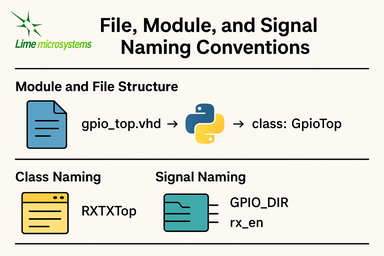
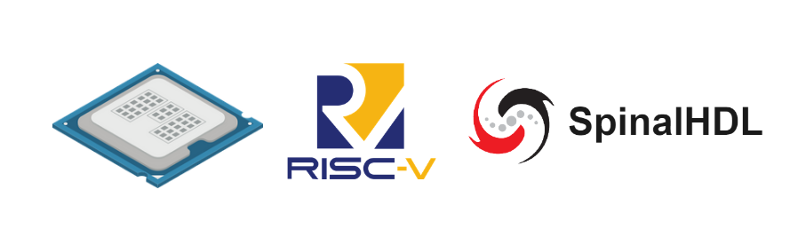

Best Practices and Guidelines
=============================

Introduction
------------
This document covers best practices and guidelines for developing with LiteX in the LimeSDR_GW
project. It includes naming conventions, portability across devices and vendors, and soft CPU core
options. These practices ensure consistency, reusability, and efficiency in your designs. For
basics on LiteX concepts, see :doc:`litex_basics`. For modifying or adding boards, refer to
:doc:`modify_project` or :doc:`add_new_board`.

File, Module, and Signal Naming Conventions
-------------------------------------------
This section details the naming conventions used throughout the LimeSDR_GW project to promote
clarity and consistency in gateware modules and LiteX/Migen wrappers.

Module and File Structure
^^^^^^^^^^^^^^^^^^^^^^^^^
Each hardware block generally consists of:

- A synthesizable RTL file (mainly in VHDL), placed in `gateware/LimeDFB/` or
  `gateware/LimeDFB_LiteX/`.
- A matching LiteX/Migen Python wrapper in `gateware/LimeDFB_LiteX/<block>/`, named with a `_top.py`
  suffix based on the module.

**Examples:**

- `gpio_top.vhd` → wrapped by → `gpio_top.py` → class: `GpioTop`
- `rx_path_top.vhd` → wrapped by → `rx_path_top.py` → class: `RXPathTop`
- `tx_path_top.vhd` → wrapped by → `tx_path_top.py` → class: `TXPathTop`
- `lms7002_top.vhd` → wrapped by → `lms7002_top.py` → class: `LMS7002Top`

Top-level gateware modules like `rxtx_top.py` and `limetop.py` instantiate these wrapped blocks,
offering a clean interface to the SoC.

Class Naming
^^^^^^^^^^^^
- Classes wrapping RTL modules use `CamelCase` and end with `Top`, e.g., `GpioTop`, `RXTXTop`,
  `LimeTop`.
- For wrappers of blocks with variants, the name indicates the specific function, e.g.,
  `RXPathTop`.

Signal Naming
^^^^^^^^^^^^^
- Signals for hardware ports or buses use uppercase with underscores (e.g., `GPIO_DIR`,
  `GPIO_OUT_VAL`).
- Internal LiteX signals follow the same style but add a `_` prefix if not for external use.
- Clock and reset signals are named by function and domain, e.g., `tx_s_clk_domain`, `rx_en`,
  `rx_pct_fifo_aclrn_req`.

AXIStream Interfaces
^^^^^^^^^^^^^^^^^^^^
- Modules with AXIStream interfaces adhere to LiteX's `sink`/`source` convention.
- Example:

.. code-block:: python

    self.sink = AXIStreamInterface(...)
    self.source = AXIStreamInterface(...)

CSRs and Registers
^^^^^^^^^^^^^^^^^^
- CSR names use lowercase with underscores (e.g., `gpio_override_val`).
- Include descriptions via `description="..."` or `CSRField(...)` metadata.
- For multi-word fields, use `CSRField` with subfields like `sec`, `min`, `hrs`.

Example:

.. code-block:: python

    self._gpo = CSRStorage(description="GPO interface", fields=[
        CSRField("cpu_busy", size=1, offset=0, description="CPU state.")
    ])

Platform Naming and IO Mapping
^^^^^^^^^^^^^^^^^^^^^^^^^^^^^^
Platform files specify physical IOs with logical signal groupings:

- The outer name groups by device function: `"LMS"`, `"FPGA_GPIO"`, `"spiflash"`, etc.
- Inside each group, `Subsignal` names use `snake_case` or uppercase for wide buses.
- IO constraints use `IOStandard(...)`, `Misc(...)`, etc.

Example:

.. code-block:: python

    ("LMS", 0,
        Subsignal("RESET", Pins("A7")),
        Subsignal("DIQ1_D", Pins("J2 L1 K1 K4 G3 ...")),
        IOStandard("LVCMOS25")
    )

Access in wrappers as:

.. code-block:: python

    lms_pads = platform.request("LMS")
    self.specials += Instance("lms7002_top", i_RESET=lms_pads.RESET, ...)

Recommendations
^^^^^^^^^^^^^^^
- Keep wrapper files brief and focused on RTL instantiation, with clear signal mappings and
  essential CSRs.
- Use hierarchical naming to show structure and improve reusability: `RXTXTop` includes `RXPathTop`
  and `TXPathTop`; `LimeTop` includes `RXTXTop`, `LMS7002Top`, etc.
- Follow these conventions consistently in new modules to support collaboration and ease onboarding
  for contributors.

Developing for Portability Across Devices and Vendors
-----------------------------------------------------
LiteX is built to make FPGA development portable, flexible, and easy to maintain across different
devices, families, and vendors. This is especially useful for the **LimeSDR_GW** project, where a
single codebase supports multiple boards using Intel, Lattice, and Xilinx FPGAs, each with unique
toolchains and peripheral needs.

LiteX enables this portability through:

- Unified **CPU/SoC abstraction** (supporting LM32, VexRiscv, PicoRV32, NeoRV32, etc.).
- Centralized **Platform/IO abstraction** (covering pins, clocks, and constraints).
- Toolchain-independent **constraints and project generation**.
- Cross-vendor **clocking (PLL)** and **memory primitives**, using the `Memory` class for flexible
  implementation choices.
- Primitive automatic instantiation/lowering (e.g., for IOs, ensuring vendor-specific elements are
  handled transparently).

These capabilities greatly simplify maintaining and porting designs across LimeSDR variants.

Unified Platform and IO Abstraction
^^^^^^^^^^^^^^^^^^^^^^^^^^^^^^^^^^^
LiteX's `Platform` abstraction consolidates pin definitions and constraints into one Python file,
avoiding manual handling of vendor-specific `.xdc`, `.qsf`, `.lpf`, or `.pcf` files. The platform
file defines the hardware interface once, and LiteX creates the right constraint files for:

- **Xilinx Vivado** (`.xdc`)
- **Intel Quartus** (`.qsf`)
- **Lattice Diamond** (`.lpf`)
- **Yosys + NextPNR** (`.pcf`, `.json`, etc.)

For example, the **LimeSDR Mini V2** works with both **Diamond** and **Yosys** toolchains, with the
platform file automatically producing the correct project and constraint files based on the chosen
toolchain, without manual changes.

Cross-Vendor IO Support: Abstracted Primitives
^^^^^^^^^^^^^^^^^^^^^^^^^^^^^^^^^^^^^^^^^^^^^^
LiteX offers high-level IO primitives that adapt automatically to the target platform:

- **SDR/DDR IOs** (`SDROutput`, `DDRInput`)
- **Differential IOs** (`DifferentialInput`, `DifferentialOutput`)
- **Clock-specific IOs** (`ClkInput`, `ClkOutput`)
- **Bidirectional IOs** (`Tristate`, `SDRTristate`, `DDRTristate`)

For instance, using `SDROutput` ensures the proper ODDR primitive (or equivalent) is instantiated
for Intel, Lattice, or Xilinx targets:

.. code-block:: python

    # Import the abstracted primitive; LiteX lowers it to vendor-specific RTL (e.g., ODDR2 for Xilinx)
    from litex.build.specials import SDROutput
    # Add the SDR output special to the design; automatically handles portability across FPGA vendors
    self.specials += SDROutput(i=tx_data, o=platform.request("data"))

This abstraction removes the need to manually code vendor-specific elements like `ODDR2`,
`ALTDDIO`, or custom wrappers.

Cross-Vendor PLL and Clocking
^^^^^^^^^^^^^^^^^^^^^^^^^^^^^
Handling clocks and clock domains across toolchains can be tricky. LiteX provides unified PLL
wrappers with a consistent interface across vendors:

.. code-block:: python

    # Import vendor-specific PLL classes; only change the import for different targets to maintain portability
    from litex.soc.cores.clock import S7PLL, ECP5PLL, AlteraPLL
    # Instantiate the PLL for the target (here ECP5); interface remains similar across vendors
    self.submodules.pll = ECP5PLL()
    # Register input clock from platform; frequency in Hz, LiteX handles vendor-specific IP generation
    self.pll.register_clkin(platform.request("clk50"), 50e6)
    # Create output clock domain; LiteX routes and instantiates appropriately for the FPGA
    self.pll.create_clkout(self.cd_sys, 100e6)

Based on the platform, LiteX will:

- Generate required IP (e.g., PLL IP for Vivado/Quartus).
- Directly instantiate hard logic blocks.
- Route clocks to suitable clock domains.

The design must use the correct PLL class associated with the target (e.g., `ECP5PLL` for Lattice
ECP5), but only the import needs to change; the interface is very similar, keeping adaptation code
minimal between one target and another.

This allows developers to set up new boards (e.g., ECP5-based LimeSDR Mini or MAX10-based LimeSDR
USB) without revising clocking logic.

Memory Abstraction and Flexibility
^^^^^^^^^^^^^^^^^^^^^^^^^^^^^^^^^^
LiteX offers a unified memory interface via the `Memory` class, letting developers choose the right
memory type—like LUT RAMs or Block RAMs—based on project requirements. This abstraction is key for
resource optimization and portability across FPGA platforms.

For example, instantiate memory with the `Memory` class and add ports:

.. code-block:: python

    from litex.gen import Memory
    # Create a memory instance with specified width and depth;
    self.submodules.mem = Memory(width=32, depth=512, init=[])
    # Get a write port for the memory.
    wr_port = self.mem.get_port(write_capable=True, clock_domain="sys")
    # Get a read port similarly; multiple ports allow flexible access without vendor-specific primitives
    rd_port = self.mem.get_port(clock_domain="sys")
    # Connect your design signals to the ports, e.g.:
    # self.comb += wr_port.adr.eq(address_signal) # Assign address for write operations
    # self.comb += wr_port.dat_w.eq(data_signal) # Provide data to write
    # self.comb += wr_port.we.eq(write_enable) # Enable write when signal is high
    # output_data.eq(rd_port.dat_r) # Read data output for use in the design

The type of inference is done automatically, but the RTL patterns are well-tested on different
devices and allow Block RAM or LUT RAM inference (or FIFO) without having to use low-level RAM
primitives, easing portability and reuse between cores.

Simplified Toolchain Integration
^^^^^^^^^^^^^^^^^^^^^^^^^^^^^^^^
LiteX creates full project files, including build scripts, for:

- **Vivado** (`.xdc`, `.tcl`)
- **Quartus** (`.qsf`, `.sdc`)
- **Diamond** (`.lpf`, `.synproj`)
- **Yosys + NextPNR** (JSON/PCF build flow)

No extra `.tcl` scripting or manual setup is needed. Developers pick the platform, and LiteX
manages the details, including flags for memory, clocking, or IPs.

Avoiding Fragmentation of CPU and Firmware
^^^^^^^^^^^^^^^^^^^^^^^^^^^^^^^^^^^^^^^^^^
Before LiteX, **LimeSDR** designs used:

- Different softcores per project (MicroBlaze, LM32, Nios-II, NeoRV32).
- Platform-specific firmware stacks.
- Inconsistent debug setups.

LiteX unifies this by allowing a single softcore choice (e.g., VexRiscv) and reusing the same CPU,
firmware, and debug framework across platforms. This eases switches between boards (e.g., from
Artix7 to MAX10 or ECP5) and cuts maintenance effort significantly.

Soft CPU Core Options
---------------------

LiteX provides a wide range of **soft and hard CPU core integrations**, allowing developers to
choose processor architectures suited to their FPGA resources and project demands. This includes
**softcores** (implemented in FPGA logic for flexibility), **hardcores** (pre-built vendor IP for
efficiency), and **configurable cores** (customizable variants with options like caches, FPUs, or
MMUs). This versatility is vital for the **LimeSDR_GW** project, where varied hardware
platforms—with different FPGA sizes and toolchain limits—require adaptable CPU solutions. LiteX's
abstraction layer keeps the project CPU-agnostic, enabling reuse of the same firmware across cores
and targets.

Supported CPUs in LiteX
^^^^^^^^^^^^^^^^^^^^^^^
LiteX supports numerous CPU options across instruction sets (e.g., RISC-V, ARM, OpenRISC) and types
(softcores like VexRiscv or PicoRV32, hardcores like Zynq ARM, and configurable variants with
extensions for performance or features). For a full list, refer to the LiteX documentation.

Tested Cores in LimeSDR_GW
^^^^^^^^^^^^^^^^^^^^^^^^^^
The following CPU cores have been validated and deployed in the LimeSDR_GW framework, focusing on
resource efficiency and control tasks:

- **VexRiscv** (RISC-V, based on SpinalHDL): The primary softcore used across all targets. It
  offers a good balance of resource use, performance, and flexibility. The standard setup uses a
  minimal variant without cache or MMU, optimized for low-latency control. Configurable advanced
  variants (with caches, FPU, or Linux support) are available for future needs, allowing
  adjustments to processing power based on firmware complexity.
- **PicoRV32** (RISC-V, ultra-compact): A lightweight alternative for designs with limited
  resources. It provides high maximum frequency (FMax) and low LUT usage, ideal for basic control
  logic. However, its simpler design limits performance, making it less ideal for demanding
  firmware tasks.

Before LiteX, LimeSDR designs used distinct softcores: MicroBlaze for Xilinx, Nios II for Intel,
and LM32 for Lattice, leading to fragmented firmware and workflows. LiteX enables using the same
default CPU (e.g., VexRiscv) on all targets, but its easy swapping—via simple changes to the
`cpu_type` and `cpu_variant` arguments—allows adaptation to FPGA resource usage, timing constraints,
and capabilities without altering the full workflow. For instance, switch to PicoRV32 for
resource-tight FPGAs or upgrade VexRiscv variants for higher processing power in firmware-heavy
scenarios.

Typical Firmware Workloads
^^^^^^^^^^^^^^^^^^^^^^^^^^
In LimeSDR_GW, the CPU typically avoids real-time I/Q streaming (handled by dedicated hardware
pipelines) and focuses on control-oriented tasks, such as:

- **Communication with the Host over USB/PCIe**: Handling packet processing, FIFO reads/writes, and
  command responses.
- **I2C/SPI communication**: Configuring peripherals like DACs, temperature sensors (e.g., LM75),
  and RF transceivers (e.g., LMS7002M registers).
- **Simple command handling**: Processing host commands (e.g., GET_INFO, LMS_RST,
  ANALOG_VAL_WR/RD) via switch statements and CSR access.
- **Flash rewrite/update**: Erasing sectors, programming pages, and managing non-volatile storage
  for values like VCTCXO DAC or serial numbers.
- **Other diagnostics**: Initializing PMICs, resetting PLLs, reading temperatures, and managing
  interrupts.

These workloads emphasize **low latency** and **small footprint** over high computational power,
matching the project's focus on efficient control. Swapping CPUs lets you scale processing power—e.g.,
adding FPU support in VexRiscv for advanced tasks—while adapting to firmware needs.

Unified Firmware and Tooling
^^^^^^^^^^^^^^^^^^^^^^^^^^^^
All supported softcores share a uniform interface for:

- **CSR bus and memory mapping**
- **Interrupts and exception handling**
- **LiteX BIOS boot sequence**
- **Debug bridges (UART/JTAG)**
- **Firmware build setup** (shared Makefiles and linker scripts)

This consistency enables seamless CPU swaps by updating just the `cpu_type` in the SoC definition:

.. code-block:: python

    class BaseSoC(SoCCore):
        def __init__(self, platform, **kwargs):
            SoCCore.__init__(self, platform,
                cpu_type = "vexriscv", # e.g., "picorv32", "neorv32"
                cpu_variant = "lite", # or "full", "debug", "smp"
                **kwargs)

LiteX's CPU abstraction supports board portability, firmware reuse, and efficient development across
device families. By easily swapping between soft, hard, or configurable cores like VexRiscv and
PicoRV32, designs can adapt to FPGA resources, timing requirements, and firmware processing needs
without major refactoring of logic or tools.
