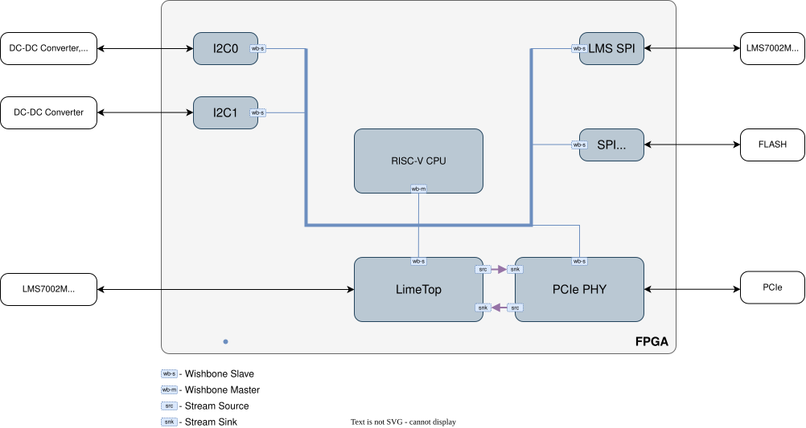

CA23
====

This section provides detailed information about the gateware implemented for the CA23 board.

Main Block Diagram
------------------

The top-level file integrates the following main blocks:

- :ref:`Soft core CPU <ca23_soft_core_cpu_module>` – VexRiscv CPU instance.
- :ref:`Lime_top Module <ca23_lime_top_module>` – Wrapper for blocks handling LMS7002M transceiver control and data transfer.
- :ref:`PCIe PHY <ca23_pcie_phy_module>` – PCIe block with the physical interface and DMA.
- :ref:`I2C0, I2C1 <ca23_i2c_modules>` and :ref:`Lms_spi <ca23_lms_spi_module>` – Communication interfaces for controlling onboard peripherals.
- :ref:`Flash <ca23_flash_module>` – Module for accessing the FPGA configuration FLASH memory.

.. _ca23_soft_core_cpu_module:

Soft core CPU Module
^^^^^^^^^^^^^^^^^^^^
The CPU module is a ``vexriscv_smp`` core provided by LiteX. It is specified via the ``cpu_type`` parameter for the ``SoCCore`` class, which serves as the parent class for the top-level gateware design.

The source code for the CPU can be found at:
`LiteX VexRiscv SMP core <https://github.com/enjoy-digital/litex/blob/master/litex/soc/cores/cpu/vexriscv_smp/core.py>`_

.. _ca23_lime_top_module:

Lime_top Module
^^^^^^^^^^^^^^^
The **Lime_top Module** serves as a wrapper for the LMS7002M transceiver control and data transfer blocks. Its main sub-blocks include:

- :ref:`LMS7002 Top Module <ca23_lms7002_top_module>` – Implements the LMS7002M PHY for digital IQ sample transmission and reception.
- :ref:`RX Path Top Module <ca23_rx_path_top_module>` – Manages the receive path from the LMS7002M to the FPGA and host, packing IQ samples into packets and generating timestamps.
- :ref:`TX Path Top Module <ca23_tx_path_top_module>` – Manages the transmit path from the host through the FPGA to the LMS7002M, unpacking IQ sample packets and handling stream synchronization with timestamps.

.. figure:: images/limetop_block_diagram.drawio.svg
   :width: 500
   :align: center
   :alt: Lime_top block diagram

.. _ca23_lms7002_top_module:

LMS7002 Top Module
^^^^^^^^^^^^^^^^^^
This module is part of LimeDFB and more details can be found in :external+dfb:ref:`lms7002_top <docs/lms7002_top/readme:lms7002_top>` description. This module implements the LMS7002M PHY for transmitting and receiving digital IQ samples.

.. _ca23_rx_path_top_module:

RX Path Top Module
^^^^^^^^^^^^^^^^^^
This module is part of LimeDFB and more details can be found in :external+dfb:ref:`rx_path_top <docs/rx_path_top/readme:rx_path_top>` description. It handles the receive path from the LMS7002M to the FPGA and host, including IQ sample packetization and timestamp generation.

.. _ca23_tx_path_top_module:

TX Path Top Module
^^^^^^^^^^^^^^^^^^
This module is part of LimeDFB and more details can be found in :external+dfb:ref:`tx_path_top <docs/tx_path_top/readme:tx_path_top>` description. This module manages the transmit path from the host through the FPGA to the LMS7002M, including unpacking of IQ samples and stream synchronization.

.. _ca23_pcie_phy_module:

PCIe PHY Module
^^^^^^^^^^^^^^^
The **PCIe PHY** module is an instantiation of the ``S7PCIEPHY`` class from LitePCIe. It provides the physical layer for the PCIe interface, including DMA support.

The source code for LitePCIe is available at:
`LitePCIe on GitHub <https://github.com/enjoy-digital/litepcie>`_

.. _ca23_i2c_modules:

I2C Modules
^^^^^^^^^^^
The **I2C0** and **I2C1** modules are instances of the ``I2CMaster`` class provided by LiteX. They are used for controlling onboard peripherals via the I2C protocol.

The source code can be found here:
`I2CMaster in LiteX <https://github.com/enjoy-digital/litex/blob/master/litex/soc/cores/bitbang.py>`_

.. _ca23_lms_spi_module:

LMS SPI Module
^^^^^^^^^^^^^^
The **Lms_spi** module is an instantiation of the ``SPIMaster`` class from LiteX. It handles SPI communication with the LMS7002M transceiver.

Source code:
`SPIMaster in LiteX <https://github.com/enjoy-digital/litex/blob/master/litex/soc/cores/spi/spi_master.py>`_

.. _ca23_flash_module:

Flash Module
------------
The **Flash** module is implemented using the ``S7SPIFlash`` class provided by LiteX. It enables access to the FPGA configuration FLASH memory.

Source code:
`S7SPIFlash in LiteX <https://github.com/enjoy-digital/litex/blob/master/litex/soc/cores/spi_flash.py>`_

Gateware Register Reference
---------------------------
CA23 exposes registers through two access paths:

- :doc:`Legacy FPGA SPI registers <ca23/reg_remap/ca23_regremap_from_csv>`: legacy host registers used by existing software and previous gateware; planned to be replaced by LiteX CSR.
- :doc:`Native LiteX CSR map <ca23/litex_doc/index>`: the SoC's dedicated CSR register space generated from LiteX modules.

During the migration phase, the host can continue accessing legacy FPGA SPI register addresses; firmware remaps these FPGA SPI register accesses to native LiteX CSR registers internally. The LiteX CSR map is the forward path for native SoC register access.

.. toctree::
   :maxdepth: 3
   :hidden:

   Legacy FPGA SPI register reference <ca23/reg_remap/ca23_regremap_from_csv>
   Register reference <ca23/litex_doc/index>
