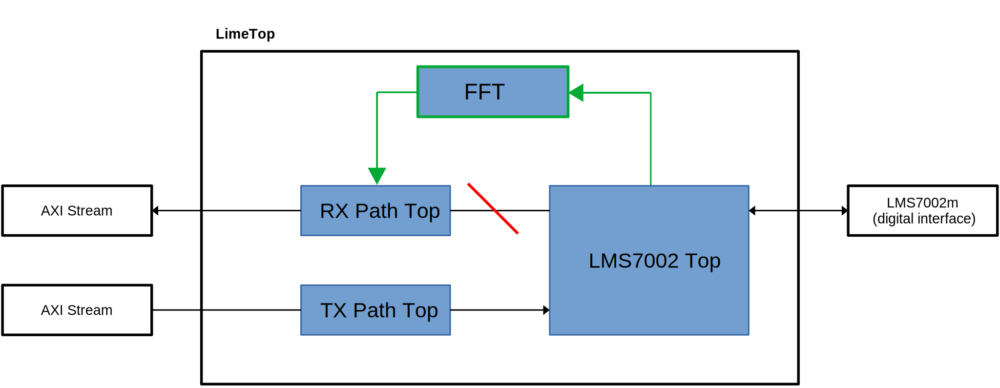
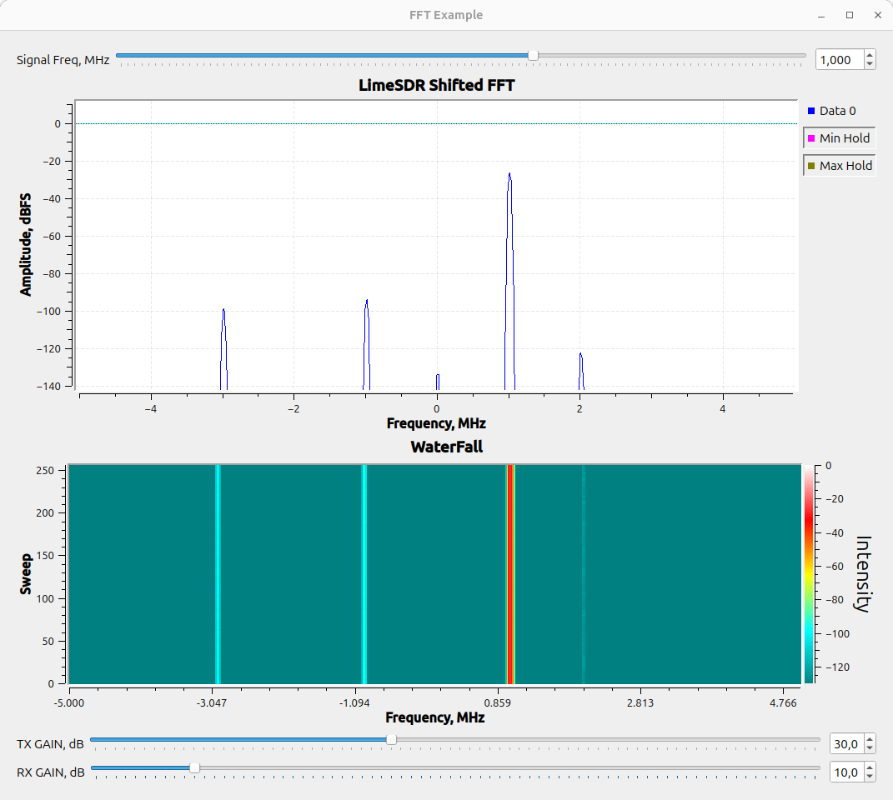
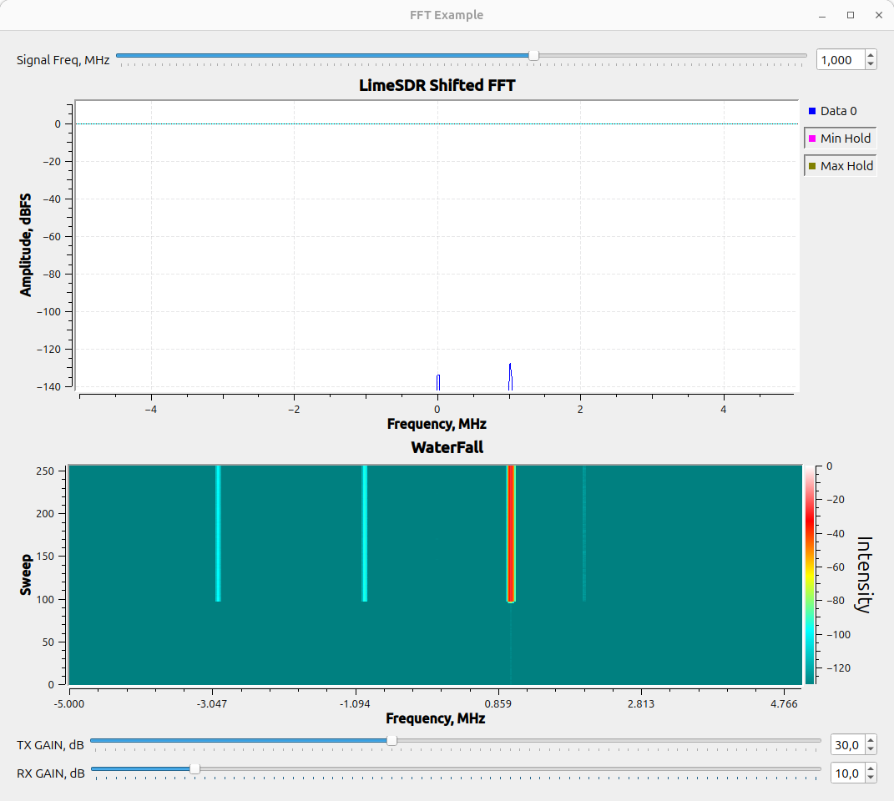

Example: Adding an FFT Module
-----------------------------
To make it easier to understand how to add a custom module, an example is provided for the LimeSDR XTRX. In this example, a fixed-point FFT module is inserted in the data receive path so that the results of the Fourier transform are packed into packets instead of raw RF samples. Since LiteX provides a flexible framework for defining hardware configurations through command-line arguments, the ``--with-fft`` argument is used to modify rx_path and include an FFT example when building the project.

If you want to try out the FFT module without modifying code, you could build the target with the following command:

.. code-block:: bash

   python3 -m boards.targets.<target> --build --with-fft [--load] [--cable <cable>]

All sources required for the example are located in **gateware/examples/fft**. The folder contains:

- **fixedpointfft.py**
  A modified fixed-point FFT module based on the `amlib`_ repository.
- **fft.v**
  The Verilog source file (pre-generated from **fixedpointfft.py**).
- **fft_wrap.vhd**
  A VHDL wrapper for **fft.v** that provides a basic AXI-STREAM interface.
- **LimeFFT.py**
  LiteX wrapper file incorporating the FFT module.
- **limesdr_fft_samples.grc**
  A GNU Radio file containing blocks that scale, shift, and display the FFT data received from the board.

In the standard design (see the `LimeSDR XTRX gateware description`_), raw samples are received by **lms7002_top** and then passed to **rx_path_top** for packetization. To reuse this logic and insert the FFT module, the FFT module should be placed between **lms7002_top** and **rx_path_top**.

Below is a block diagram showing the desired structure. New elements are highlighted in green, and elements to be removed are marked in red.

Instantiating FFT Example module
~~~~~~~~~~~~~~~~~~~~~~~~~~~~~~~~~~

This code snippet below from **gateware/LimeTop.py** file adds an FFT example to the design when the with_fft flag is enabled. 

.. code-block:: python

            # FFT example --------------------------------------------------------------------------------------
            if with_fft:
                # Define Reset signal
                fft_reset_n = Signal()
                # Connect newly defined reset signal to main rx path reset trough MultiReg
                self.specials += MultiReg(self.fpgacfg.rx_en, fft_reset_n, odomain=self.lms7002_top.source.clock_domain)

                # Instantiate FFT module
                self.fft_example = LimeFFT(platform=platform,
                                           sink_clk_domain=self.lms7002_top.source.clock_domain,
                                           source_clk_domain=self.lms7002_top.source.clock_domain)

                # Connect reset signal to FFT module
                self.comb += self.fft_example.reset.eq(~fft_reset_n)

Connecting FFT Example module
~~~~~~~~~~~~~~~~~~~~~~~~~~~~~~~~~~

To avoid conflicting assignments, you must disconnect the **lms7002_top** master interface from the **rx_path_top** slave interface. In code snippet below you can check how ``rx_pipeline`` is modified and ``--with-fft`` argument is used in **gateware/LimeTop.py** file to isert FFT module:

.. code-block:: python

            # LMS7002 -> [LimeFFT example] -> RX Path -> Sink Pipeline.
            if with_lms7002 and with_rx_tx_top and with_fft:
                # LMS7002 -> RX Path -> Sink Pipeline.
                self.rx_pipeline = stream.Pipeline(
                    self.lms7002_top,
                    self.fft_example,  # Inserting FFT module
                    self.rxtx_top.rx_path,
                    self.source,
                )
            elif with_lms7002 and with_rx_tx_top:
                self.rx_pipeline = stream.Pipeline(
                    self.lms7002_top,
                    self.rxtx_top.rx_path,
                    self.source,
                )

Checking FFT results
~~~~~~~~~~~~~~~~~~~~~~~~~~~~~

After these modifications, build the project and program the board as described in :ref:`Building the project<docs/build_project:building and loading the gateware>`.

The FFT results can be observed using the **limesdr_fft_samples.grc** file provided with the example. Ensure that you have up-to-date versions of GNU Radio and LimeSuiteNG installed.

Before running flowgraph modify ``board_ini`` variable with correct setup file:

If an RF cable is connected so that it connects RX and TX of A channel, output in GNU Radio should look like in figure below, it should also react to interactions with the frequency slider.

However, if no cable is connected, or the cable is connected improperly, the output should look like in figure below.

.. _amlib: https://github.com/amaranth-farm/amlib
.. _LimeSDR XTRX gateware description: https://limesdrgw.myriadrf.org/docs/limesdr_xtrx
.. _LiteX documentation: https://github.com/enjoy-digital/litex/wiki/Reuse-a-(System)Verilog,-VHDL,-Amaranth,-Spinal-HDL,-Chisel-core

