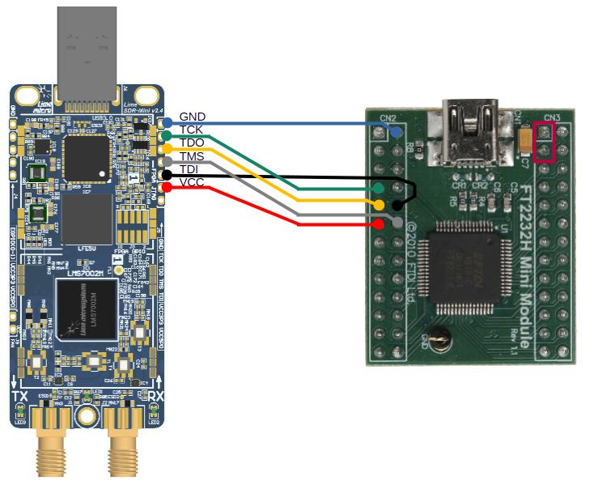

LimeSDR Mini V2 Build Instructions
==================================

To build gateware for the **limesdr_mini_v2** target, first activate the virtual environment and then run the build command:

.. code:: bash

   source .venv/bin/activate
   python3 -m boards.targets.limesdr_mini_v2 --build

.. note::

   - Ensure that the required toolchain is installed and configured before building. See
     :ref:`Requirements <requirements>` for the board-specific requirements.

   - Run the build command from the **project root directory**.

Available Build Options
-----------------------

**Command:**

.. code:: bash

   python3 -m boards.targets.limesdr_mini_v2 --build [--load] [--flash] [--flash-user] [--flash-golden] [--toolchain=TOOLCHAIN] [--cable <cable>]

**Options:**

- ``--load``: Load the bitstream into SRAM.
- ``--flash``: Program the combined user and golden image into SPI flash.
- ``--flash-user``: Program the user bitstream at address ``0x00000000``.
- ``--flash-golden``: Program the golden bitstream at address ``0x00140000``.
- ``--toolchain=TOOLCHAIN``: Select ``trellis`` or ``diamond``. The default is ``trellis``.
- ``--cable <cable>``: Specify the JTAG cable. The default is ``ft2232``.
  Use ``openFPGALoader --list-cables`` to list supported cable names.

User and Golden Bitstreams
--------------------------

- The **user bitstream** is built using the commands above.
- The **golden bitstream** is located in ``bitstream/LimeSDR_Mini_V2/``.

After generating the user bitstream, the following files are available:

- **limesdr_mini_v2.bin**: Combined image containing both the golden and user bitstreams.
- **tools/limesdr_mini_v2.mcs**: The same image in Intel Hex (iHex) format.

.. note::

   Due to limitations in **prjtrellis**, Lattice Diamond must be installed and available in
   ``$PATH`` to generate ``tools/limesdr_mini_v2.mcs``.

Programming Cables
------------------

The FT2232H Mini Module provides a low-cost JTAG programming interface for LimeSDR Mini v2 and other Lattice FPGA devices.

.. list-table:: Table 1. Tested JTAG Programming Cables
   :header-rows: 1
   :widths: 35 15 50

   * - **Hardware**
     - **Version**
     - **Comment**
   * - `FT2232H Mini Module <https://ftdichip.com/products/ft2232h-mini-module/>`_
     -
     - Compatible JTAG programming cable

The FT2232H Mini Module costs approximately $20 from distributors such as Digi-Key and Mouser. JTAG uses four signals: TCK, TMS, TDI, and TDO. This setup uses FT2232H port A (0).

FT2232H Mini Module preparation:

* Connect CN3-1 to CN3-3 to supply VCC from USB VBUS.
* Connect LimeSDR Mini v2 to the FT2232H Mini Module as specified in Table 2 and shown in Figure 1.

.. table:: Table 2. LimeSDR Mini v2 board and FT2232H Mini module connections

  +------------------------------------+---------------------------------+
  | **LimeSDR Mini v2**                | **FT2232H Mini module**         |
  +====================================+=================================+
  | J5-1 (GND)                         | CN2-2 (GND)                     |
  +------------------------------------+---------------------------------+
  | J5-2 (FPGA_JTAG_TCK)               | CN2-7 (AD0)                     |
  +------------------------------------+---------------------------------+
  | J5-3 (FPGA_JTAG_TDO)               | CN2-9 (AD2)                     |
  +------------------------------------+---------------------------------+
  | J5-4 (FPGA_JTAG_TMS)               | CN2-12 (AD3)                    |
  +------------------------------------+---------------------------------+
  | J5-5 (FPGA_JTAG_TDI)               | CN2-10 (AD1)                    |
  +------------------------------------+---------------------------------+
  | J5-6 (VCC3P3)                      | CN2-11 (VIO)                    |
  +------------------------------------+---------------------------------+

   Figure 1: LimeSDR Mini v2 board and FT2232H Mini module connections

Flashing Instructions
---------------------

To write bitstreams to SPI flash:

- **Full flash image (user + golden):**

  .. code:: bash

     python3 -m boards.targets.limesdr_mini_v2 --flash

- **User bitstream only:**

  .. code:: bash

     python3 -m boards.targets.limesdr_mini_v2 --flash-user

- **Golden bitstream only:**

  .. code:: bash

     python3 -m boards.targets.limesdr_mini_v2 --flash-golden
