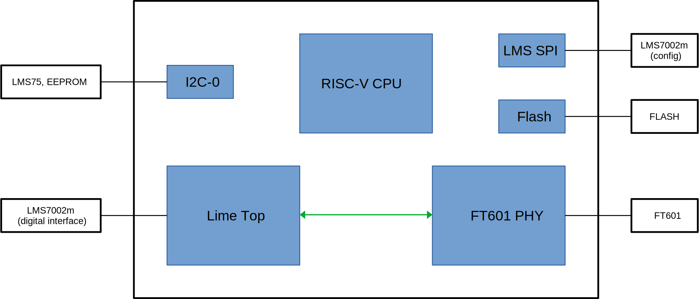

LimeSDR Mini V2
===============

This section provides detailed information about the gateware implemented for the LimeSDR Mini V2 board.

Main Block Diagram
------------------
The top-level file integrates the following main blocks:

- :ref:`Soft core CPU Module <soft_core_cpu_module>` – VexRiscv CPU instance.
- :ref:`Lime_top Module <lime_top_module>` – Wrapper for blocks handling LMS7002M transceiver control and data transfer.
- :ref:`FT601 PHY Module <ft601_phy_module>` – Handles control and data stream endpoints between CPU, streaming interface, and FT601 device.
- :ref:`I2C Module <i2c_modules>` and :ref:`Lms_spi Module <lms_spi_module>` – Communication interfaces for controlling onboard peripherals.
- :ref:`Flash Module <flash_module>` – Module for accessing the FPGA configuration FLASH memory.

.. _soft_core_cpu_module:

Soft core CPU Module
--------------------
The CPU module is a ``vexriscv`` core provided by LiteX. It is specified via the ``cpu_type`` parameter for the ``SoCCore`` class, which serves as the parent class for the top-level gateware design.

The source code for the CPU can be found at:
`LiteX VexRiscv core <https://github.com/enjoy-digital/litex/blob/master/litex/soc/cores/cpu/vexriscv/core.py>`_

.. _lime_top_module:

Lime_top Module
---------------
The **Lime_top Module** serves as a wrapper for the LMS7002M transceiver control and data transfer blocks. Its main sub-blocks include:

- :ref:`LMS7002 Top Module <lms7002_top_module>` – Implements the LMS7002M PHY for digital IQ sample transmission and reception.
- :ref:`RX Path Top Module <rx_path_top_module>` – Manages the receive path from the LMS7002M to the FPGA and host, packing IQ samples into packets and generating timestamps.
- :ref:`TX Path Top Module <tx_path_top_module>` – Manages the transmit path from the host through the FPGA to the LMS7002M, unpacking IQ sample packets and handling stream synchronization with timestamps.

.. _lms7002_top_module:

LMS7002 Top Module
~~~~~~~~~~~~~~~~~~
This module is part of LimeDFB and more details can be found in :external+limedfb:ref:`lms7002_top <docs/lms7002_top/readme:lms7002_top>` description. This module implements the LMS7002M PHY for transmitting and receiving digital IQ samples.

.. _rx_path_top_module:

RX Path Top Module
~~~~~~~~~~~~~~~~~~
This module is part of LimeDFB and more details can be found in :external+limedfb:ref:`rx_path_top <docs/rx_path_top/readme:rx_path_top>` description. It handles the receive path from the LMS7002M to the FPGA and host, including IQ sample packetization and timestamp generation.

.. _tx_path_top_module:

TX Path Top Module
~~~~~~~~~~~~~~~~~~
This module is part of LimeDFB and more details can be found in :external+limedfb:ref:`tx_path_top <docs/tx_path_top/readme:tx_path_top>` description. This module manages the transmit path from the host through the FPGA to the LMS7002M, including unpacking of IQ samples and stream synchronization.

.. _ft601_phy_module:

FT601 PHY Module
----------------
The **FT601 PHY** module serves as a wrapper for both the logical and physical interfaces
of the FT601 device. It provides the following endpoints and FIFOs:

- **Control (PC → FPGA)**: Handles configuration commands from the PC to the FPGA.
- **Control (FPGA → PC)**: Enables register readback and status reporting from the FPGA to the PC.
- **TX Data Path (PC → LMS7002)**: Transfers transmission data from the PC to the LMS7002.
- **RX Data Path (LMS7002 → PC)**: Transfers received data from the LMS7002 to the PC.

.. _i2c_modules:

I2C Module
-----------
The **I2C0** module is an instance of the ``I2CMaster`` class provided by LiteX. It is used for controlling onboard peripherals via the I2C protocol.

The source code can be found here:
`I2CMaster in LiteX <https://github.com/enjoy-digital/litex/blob/master/litex/soc/cores/bitbang.py>`_

.. _lms_spi_module:

Lms_spi Module
--------------
The **Lms_spi Module** is an instantiation of the ``SPIMaster`` class from LiteX. It handles SPI communication with the LMS7002M transceiver.

Source code:
`SPIMaster in LiteX <https://github.com/enjoy-digital/litex/blob/master/litex/soc/cores/spi/spi_master.py>`_

.. _flash_module:

Flash Module
------------
The **Flash Module** is implemented using the ``S7SPIFlash`` class provided by LiteX. It enables access to the FPGA configuration FLASH memory.

Source code:
`S7SPIFlash in LiteX <https://github.com/enjoy-digital/litex/blob/master/litex/soc/cores/spi_flash.py>`_
