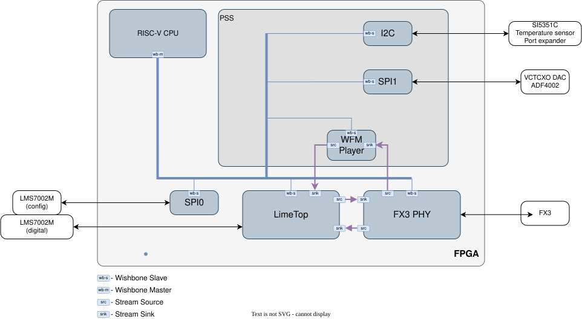
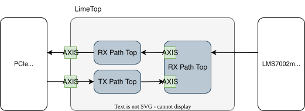

LimeSDR USB
===========

This section provides detailed information about the gateware implemented for the LimeSDR USB board.

Main Block Diagram
------------------
The LimeSDR USB gateware integrates several high-level subsystems to handle USB 3.0 connectivity,
RF processing, and peripheral management on the Intel/Altera Cyclone IV FPGA.

- :ref:`Soft core CPU Module <soft_core_cpu_module_usb>` – VexRiscv CPU instance (minimal or standard).
- :ref:`Lime_top Module <lime_top_module_usb>` – RF data path and LMS7002M digital interface.
- :ref:`FX3 PHY Module <fx3_phy_module_usb>` – USB 3.0 Slave FIFO interface via Cypress FX3.
- :ref:`PSS (Peripheral Support Subsystem) <pss_module_usb>` – Integrated board management (SPI, I2C, GPIO).

.. _soft_core_cpu_module_usb:

Soft core CPU Module
--------------------
The LimeSDR USB uses the ``vexriscv`` soft core. Depending on the build configuration, one of
two variants is selected:

- **Minimal variant**: Optimized for size, used in production builds to fit the Cyclone IV resources.
- **Standard variant**: Used in debug builds (``--with-cpu-debug``) to provide full RISC-V debug support.

The CPU manages the LMS64C protocol, coordinates peripheral access through the PSS, and
configures the LimeTop modules.

Source code:
`LiteX VexRiscv core <https://github.com/enjoy-digital/litex/blob/master/litex/soc/cores/cpu/vexriscv/core.py>`_

.. _lime_top_module_usb:

Lime_top Module
^^^^^^^^^^^^^^^
The **Lime_top Module** serves as a wrapper for the LMS7002M transceiver control and data transfer blocks. Its main sub-blocks include:

- :ref:`LMS7002 Top Module <lms7002_top_module>` – Implements the LMS7002M PHY for digital IQ sample transmission and reception.
- :ref:`RX Path Top Module <rx_path_top_module>` – Manages the receive path from the LMS7002M to the FPGA and host, packing IQ samples into packets and generating timestamps.
- :ref:`TX Path Top Module <tx_path_top_module>` – Manages the transmit path from the host through the FPGA to the LMS7002M, unpacking IQ sample packets and handling stream synchronization with timestamps.

.. _lms7002_top_module:

LMS7002 Top Module
^^^^^^^^^^^^^^^^^^
This module is part of LimeDFB and more details can be found in :external+dfb:ref:`lms7002_top <docs/lms7002_top/readme:lms7002_top>` description. This module implements the LMS7002M PHY for transmitting and receiving digital IQ samples.

.. _rx_path_top_module:

RX Path Top Module
^^^^^^^^^^^^^^^^^^
This module is part of LimeDFB and more details can be found in :external+dfb:ref:`rx_path_top <docs/rx_path_top/readme:rx_path_top>` description. It handles the receive path from the LMS7002M to the FPGA and host, including IQ sample packetization and timestamp generation.

.. _tx_path_top_module:

TX Path Top Module
^^^^^^^^^^^^^^^^^^
This module is part of LimeDFB and more details can be found in :external+dfb:ref:`tx_path_top <docs/tx_path_top/readme:tx_path_top>` description. This module manages the transmit path from the host through the FPGA to the LMS7002M, including unpacking of IQ samples and stream synchronization.

.. _fx3_phy_module_usb:

FX3 PHY Module
--------------
The **FX3 PHY** module implements the Slave FIFO (GPIF II) protocol to communicate with the
Cypress FX3 USB 3.0 controller.

- **Clocking**: Operates on a 100MHz ``FX3_PCLK`` (also used as sys clk) provided by the FX3 chip.
- **Interface**: 32-bit parallel bus, converted to 64-bit internally for LimeTop.
- **DMA Sockets**: Segregates data and control traffic into 4 independent sockets:

    - **Control (PC → FPGA)**: Handles configuration commands from the PC to the FPGA.
    - **Control (FPGA → PC)**: Enables register readback and status reporting from the FPGA to the PC.
    - **TX Data Path (PC → LMS7002M)**: Transfers transmission data from the PC to the LMS7002M.
    - **RX Data Path (LMS7002M → PC)**: Transfers received data from the LMS7002M to the PC.

- **Host-to-FPGA Data Muxing**: The FX3 module includes internal muxing logic to redirect the TX data stream when waveform loading is enabled.

    - **Standard Path**: When waveform loading is disabled (default), data is sent to the **LimeTop TX Path**.
    - **WFM Loading Path**: When waveform loading is enabled, the data stream is redirected to an internal Packet Payload Extractor, removing the 16-byte header from each 4096-byte data packet and passing the raw IQ payload to the WFM Player.

.. _pss_module_usb:

PSS (Peripheral Support Subsystem)
----------------------------------
The **PSS_LimeSDR_Usb** module encapsulates all board-specific low-speed peripherals. This
pattern isolates the board-level logic from the generic SoC core.

- **fpga_spi1**: A dedicated SPI master for board peripherals.

    - **AD5601 DAC**: Controlled using SPI Mode 1 to set the VCTCXO frequency.
    - **ADF4002 PLL**: Controlled using SPI Mode 0 for clock synchronization.
- **I2C Master**: Controls the SI5351C clock generator, temperature sensors, and EEPROM.
- **GPIO & LEDs**:

    - Heartbeat LED and status indicators.
    - Fan control logic.
    - RF loopback switches.
- **WFM Player**: A DDR2-backed waveform playback engine (enabled when DDR is present).

    - **Waveform Loading**: Data is received via the FX3 muxed path, stripped of packet headers by the payload extractor, and written to the on-board DDR2 memory.
    - **Waveform Playback**: Stored samples are read from DDR2, passed through a decompressor, and streamed to the **LMS7002 Top** module for transmission.

Gateware Register Reference
---------------------------
LimeSDR USB exposes registers through two access paths:

- :doc:`Legacy FPGA SPI registers <limesdr-usb/reg_remap/usb_regremap_from_csv>`: legacy host registers used by existing software and previous gateware; planned to be replaced by LiteX CSR.
- :doc:`Native LiteX CSR map <limesdr-usb/litex_doc/index>`: the SoC's dedicated CSR register space generated from LiteX modules.

During the migration phase, the host can continue accessing legacy FPGA SPI register addresses; firmware remaps these FPGA SPI register accesses to native LiteX CSR registers internally. The LiteX CSR map is the forward path for native SoC register access.

.. toctree::
   :maxdepth: 3
   :hidden:

   Legacy FPGA SPI register reference <limesdr-usb/reg_remap/usb_regremap_from_csv>
   Register reference <limesdr-usb/litex_doc/index>
