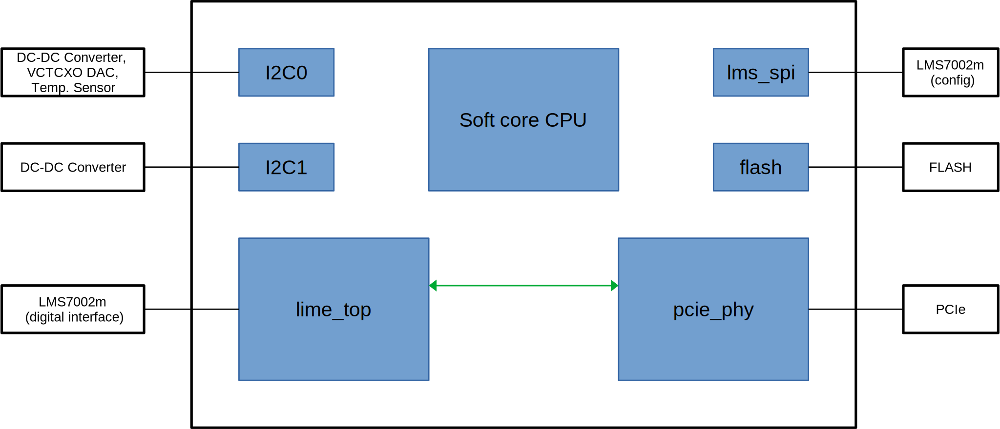
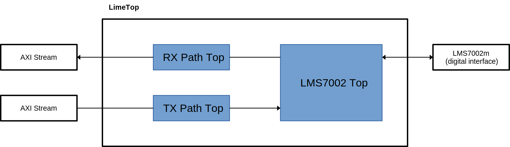

LimeSDR XTRX
============

This section provides information about LimeSDR XTRX gateware

Main block diagram
------------------

Top level file contains these main blocks:

    - :ref:`Soft core CPU<docs/limesdr_xtrx:soft core cpu module>` - VexRiscv CPU instance 
    - :ref:`Lime_top<docs/limesdr_xtrx:lime_top module>` - blocks specific to lms7002m transceiver control and data transfer
    - :ref:`Pcie_phy<docs/limesdr_xtrx:pcie_phy module>` - PCIe block with physical interface and DMA
    - :ref:`I2C0, I2C1<docs/limesdr_xtrx:i2c0, i2c1 modules>`, :ref:`Lms_spi<docs/limesdr_xtrx:lms_spi module>` - communication interfaces to control onboard periphery
    - :ref:`Flash<docs/limesdr_xtrx:flash module>` - FPGA configuration FLASH memory access

Soft core CPU module
--------

CPU module is a ``vexriscv_smp`` core provided by LiteX. It is implemented as a ``cpu_type`` parameter for the ``SoCCore`` class, which is 
the parent class for the top level of the gateware design.

The source code for the cpu can be found using `this link <https://github.com/enjoy-digital/litex/blob/master/litex/soc/cores/cpu/vexriscv_smp/core.py>`__.

Lime_top module
--------

Block **lime_top** is a wrapper file for specific lms7002m transceiver control and data transfer blocks. Main blocks are following:

    - :external+limedfb:ref:`lms7002_top <docs/lms7002_top/readme:lms7002_top>` - lms7002 IC phy for sending/receiving digital IQ samples.
    - :external+limedfb:ref:`rx_path_top <docs/rx_path_top/readme:rx_path_top>` - receive path (LMS7002M -> FPGA -> HOST), responsible for packing IQ samples into packets and timestamp generation.
    - :external+limedfb:ref:`tx_path_top <docs/tx_path_top/readme:tx_path_top>` - transmit path (HOST -> FPGA -> LMS7002M), responsible for unpacking received packets into IQ samples and stream synchronization with timestamp.

Pcie_phy module
--------

**Pcie_phy** is an instance of ``S7PCIEPHY`` class, which is part of LitePCIe. Source code for LitePCIe can be found using `this link <https://github.com/enjoy-digital/litepcie>`__.

I2C0, I2C1 modules
--------

**I2C0** and **I2C1** modules are instances of ``I2CMaster`` class provided by LiteX. Source code for the class can be found using `this link <https://github.com/enjoy-digital/litex/blob/master/litex/soc/cores/bitbang.py>`__.

Lms_spi module
--------

**Lms_spi** module is an instance of ``SPIMaster`` class provided by LiteX.  Source code for the class can be found using `this link <https://github.com/enjoy-digital/litex/blob/master/litex/soc/cores/spi/spi_master.py>`__.

Flash module
--------

**Flash** module is an instance of ``S7SPIFlash`` class provided by LiteX.  Source code for the class can be found using `this link <https://github.com/enjoy-digital/litex/blob/master/litex/soc/cores/spi_flash.py>`__.

