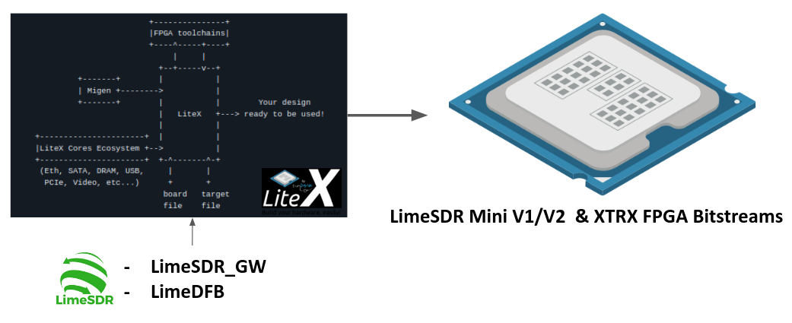
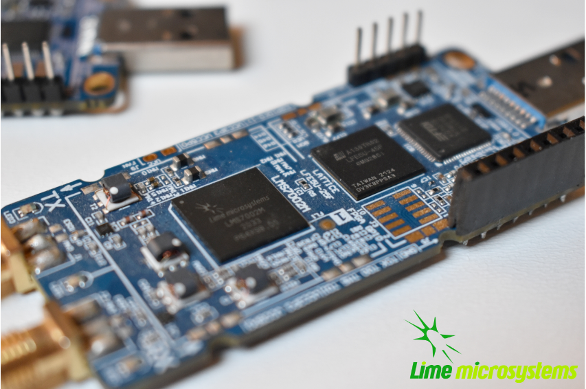
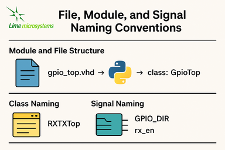
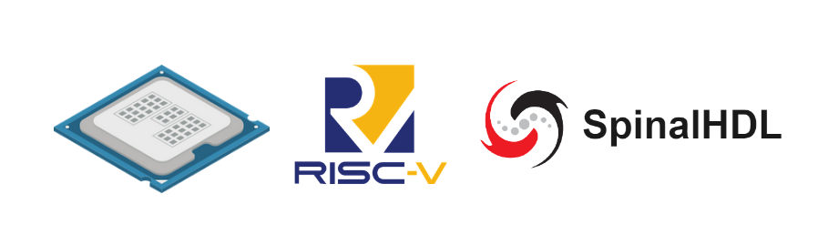

LiteX Basics
============

Introduction to LiteX in LimeSDR_GW
-----------------------------------
This document introduces the basics of **LiteX** as used in the **LimeSDR_GW** project. It covers
key concepts like platforms, targets, wrappers, naming conventions, and portability features.
LiteX is central to the project, providing a flexible, vendor-neutral framework for building SoCs.
If you're new to LiteX or need to understand its integration with LimeSDR_GW and LimeDFB, this is a
good starting point. For more on repository structure, see :doc:`project_structure`. For
advanced usage like adding boards, refer to :doc:`add_new_board`.

Overview of LiteX usage in LimeSDR_GW
^^^^^^^^^^^^^^^^^^^^^^^^^^^^^^^^^^^^^
.. figure:: images/limesdr_litex_logos.png
   :width: 800
   :align: center
   :alt: LimeSDR + LiteX

**LiteX** is an open-source SoC builder toolkit that uses Python to define, integrate, and assemble
FPGA-based systems. It automates challenging SoC components, such as bus interconnections,
clock/reset management, memory allocation, CPU integration, and firmware/toolchain compilation.

Unlike traditional HDL methods or proprietary tools like Vivado's Block Design, LiteX offers a
flexible, vendor-neutral workflow that seamlessly connects hardware and software.

Core features include:

- **Hardware Integration**: Connects modules, manages clock/reset domains, and handles system buses
  with minimal overhead.
- **CPU and Firmware Support**: Supports various soft-core processors (e.g., VexRiscv, LM32) and
  automates firmware builds (including linker scripts and BIOS).
- **Toolchain Automation**: Handles firmware and FPGA compilation pipelines—running synthesis,
  placement/routing, bitstream generation, and firmware builds with simple commands.
- **Vendor Neutrality**: Works with Intel, Xilinx, Lattice, and others through adaptable platform
  definitions.
- **Multi-Language Support**: Easily incorporates existing Verilog/VHDL components via wrappers.

The **LimeSDR_GW** repository uses LiteX to provide a consolidated gateware base for LimeSDR
variants (e.g., Mini V1/V2, XTRX). It replaces scattered HDL projects with a systematic,
sustainable LiteX-based SoC for SDR applications.

It incorporates the **LimeDFB** library (hosted on GitHub at myriadrf/LimeDFB), featuring modular
VHDL components for RF data processing (e.g., RX/TX paths for the LMS7002M). These modules are
reusable and adaptable for other RF transceivers.

Advantages of the LimeSDR_GW and LimeDFB approach include:

- **Reusability**: Shared RF and interface components (e.g., streaming engines, LMS7002M
  controllers) across all boards.
- **Sustainability**: A single, uniform architecture replaces fragmented per-board HDL branches.
- **Modularity**: Clear separation of RF processing (LimeDFB), SoC management (LiteX), and
  board-specific configs (platform/target).
- **Expandability**: Easy addition of new boards or variants by extending platform/target files,
  without duplicating logic.
- **Portability**: Greater flexibility for migrating to new FPGA families or upcoming LimeSDR
  versions.
- **Collaboration**: Standardized designs improve readability and reduce onboarding challenges for
  contributors.

This approach replaces isolated, board-specific HDL projects with a unified, scalable framework that
accelerates innovation while reducing technical debt.

Benefits of Using LiteX (in the Context of LimeSDR_GW)
^^^^^^^^^^^^^^^^^^^^^^^^^^^^^^^^^^^^^^^^^^^^^^^^^^^^^^
LiteX delivers substantial improvements to SDR gateware development within the LimeSDR_GW
ecosystem:

- **Unified SoC Framework**: Platforms like Mini V1/V2 and XTRX share a common blueprint,
  facilitating maintenance and consistent features across configurations.
- **Streamlined Board Setup**: Python-based platform and target scripts quickly define clocks, pin
  assignments, and memory layouts, eliminating custom HDL top-level files.
- **Reusable Host Interfaces**: PCIe and USB modules are modularized for reuse, minimizing
  redundant work.
- **Seamless Firmware Pipeline**: Integrating a soft CPU (e.g., VexRiscv or PicoRV32) requires
  minimal Python code, with LiteX handling firmware compilation, linker files, and deployment
  automatically.
- **Fast Prototyping Cycles**: Simultaneous hardware and software modifications in a single
  environment speed up development and debugging.
- **Cross-FPGA Portability**: Designs can be ported to different FPGA vendors (Xilinx, Intel,
  Lattice) by simply updating the platform definition and making minor vendor-specific adjustments.
- **Open Toolchain Support**: LiteX integrates with open-source FPGA tools (e.g., Yosys, Nextpnr)
  where possible, enabling fully transparent development workflows.

Before LiteX, LimeSDR boards used separate HDL projects dependent on vendor-specific tools.
Processor choices varied: MicroBlaze for Xilinx, Nios II for Intel, and LM32 for Lattice. Each had
unique firmware toolchains, memory maps, diagnostics, and flashing methods. Switching boards
required adapting to different environments, hindering code sharing and debugging consistency.

The LiteX-based LimeSDR_GW overcomes this fragmentation with a shared SoC structure, standardized
firmware management, and unified debugging tools. This greatly lowers barriers for adding new boards
or features, making development, validation, and collaboration far more efficient.

Understanding Core LiteX Concepts: Boards, Platforms, Targets
-------------------------------------------------------------
LiteX structures FPGA designs around three key concepts: **boards**, **platforms**, and **targets**.
Unlike traditional design flows, where these are spread across HDL source files, constraint
documents (e.g., `.xdc`, `.sdc`, or `.lpf`), and vendor-specific project settings, LiteX
centralizes them in Python scripts. This provides a portable, vendor-neutral, and toolchain-aware
method for specifying systems.

This section explains each concept, using the **LimeSDR Mini V2** as a real-world example.

Platform = Board + Constraints
^^^^^^^^^^^^^^^^^^^^^^^^^^^^^^
In LiteX, the platform represents the physical hardware board and its constraints. Rather than
scattering pin assignments and timing specs across separate HDL and constraint files, LiteX
consolidates them into a single **platform Python file** (e.g., `limesdr_mini_v2_platform.py`).

This file includes:

- Definitions for all available I/Os (clocks, SPI, I2C, LMS7002M interfaces, USB FIFO, LEDs, etc.)
- Electrical characteristics (`IOStandard`, `Misc`, pull-up resistors, etc.)
- Timing constraints via methods like `add_period_constraint()`
- The FPGA device identifier
- Programming interface configuration (`create_programmer`)

LiteX parses this file to generate suitable project and constraint files for tools like Vivado,
Quartus, Diamond, or Yosys/Nextpnr.

LMS7002M I/O Block on LimeSDR Mini V2
^^^^^^^^^^^^^^^^^^^^^^^^^^^^^^^^^^^^^
This I/O definition specifies all signals connecting the FPGA to the LMS7002M transceiver, including
control lines, RX/TX digital data paths, and clock signals:

.. code-block:: python

    ("LMS", 0,
        # Control.
        Subsignal("RESET", Pins("A7")),
        Subsignal("CORE_LDO_EN", Pins("C6")),
        Subsignal("RXEN", Pins("D6")),
        Subsignal("TXEN", Pins("B7")),
        # RX Interface (LMS → FPGA).
        Subsignal("DIQ1_D", Pins("J2 L1 K1 K4 G3 F4 J1 H1 G4 F2 G1 H2")),
        Subsignal("TXNRX1", Pins("F1")),
        Subsignal("ENABLE_IQSEL1", Pins("F3")),
        Subsignal("MCLK1", Pins("H4")),
        Subsignal("FCLK1", Pins("H3")),
        # TX Interface (FPGA → LMS).
        Subsignal("DIQ2_D", Pins("A3 C2 A2 B4 C3 B2 D3 B1 A4 C1 C7 A6")),
        Subsignal("TXNRX2_or_CLK_SEL", Pins("B6")),
        Subsignal("ENABLE_IQSEL2", Pins("C4")),
        Subsignal("MCLK2", Pins("D2")),
        Subsignal("FCLK2", Pins("D1")),
        # Electrical standard.
        IOStandard("LVCMOS25")
    ),

This method replaces the conventional spread across a main HDL wrapper and multiple `.xdc`/`.lpf`/`.sdc` files.

Timing Constraints Generation
^^^^^^^^^^^^^^^^^^^^^^^^^^^^^
Main timing constraints related to hardware oscillators are defined programmatically in the
platform's `do_finalize()` function:

.. code-block:: python

    def do_finalize(self, fragment):
        self.add_period_constraint(self.lookup_request("LMK_CLK"), 1e9/40e6)
        self.add_period_constraint(self.lookup_request("FT_CLK"), 1e9/100e6)
        self.add_period_constraint(self.lookup_request("LMS:MCLK1"), 1e9/125e6)
        self.add_period_constraint(self.lookup_request("LMS:MCLK2"), 1e9/125e6)

LiteX then translates these into the appropriate format for the selected toolchain:

- `.lpf` for **Diamond**
- `.sdc` for **Nextpnr**
- `.xdc` for **Vivado**
- `.qsf` and `.sdc` for **Quartus**

As created in the user design, other timing constraints can also be added in the target. Timing
constraints directly derived from PLLs/MMCMs are generally automatically added by the tools if the
source constraint is defined, so there is generally no need to add them manually (The approach can
still depend on the toolchain and timing reports need to be verified after build).

Multiple Toolchain Support
^^^^^^^^^^^^^^^^^^^^^^^^^^
Since LiteX uses its own IO and timing constraints definitions and supports multiple toolchains when
available for the same FPGA family, switching between toolchains is simply a matter of changing the
toolchain argument.

The LimeSDR Mini V2 supports both **Lattice Diamond** and **Yosys + Nextpnr** workflows:

- The same Python platform file is used for both.
- LiteX generates the relevant build artifacts based on the specified toolchain.
- For example:
  - With ``--toolchain=diamond`` → `.ldf`, `.lpf`, VHDL-compatible sources
  - With ``--toolchain=trellis`` → `.json`, `.sdc`, `pcf`

This enables smooth switches between proprietary and open-source toolchains without duplicating
designs or constraints.

Target = SoC Top-Level + Flow Control
^^^^^^^^^^^^^^^^^^^^^^^^^^^^^^^^^^^^^
The *target* file (e.g., `limesdr_mini_v2.py`) serves as the main entry point. It manages:

- Instantiation of the platform class
- Initialization of the SoC core
- Connection of peripherals, memory regions, buses, and clock domains
- Integration of logic for the LMS7002M (via `LimeTop`), FT601 USB interface, SPI, I2C, and other
  components
- Addition of optional features like LiteScope analyzers or UARTBone

The same file can be used to build, load, or test a bitstream with different options:

.. code-block:: bash

    # Open-source toolchain build + load
    python3 -m boards.targets.limesdr_mini_v2 --toolchain=trellis --build --load
    # Diamond toolchain build + flash
    python3 -m boards.targets.limesdr_mini_v2 --toolchain=diamond --build --flash

How It All Fits Together
^^^^^^^^^^^^^^^^^^^^^^^^
- **Platform** = Unified Python representation of board I/O, constraints, and flashing method
- **Target** = Main SoC builder that handles system wiring
- **Toolchain files** = Automatically generated based on the platform and selected toolchain

This structure supports consistent, flexible designs across various LimeSDR boards and FPGA vendors,
removing the need to modify underlying HDL or constraint files.

.. _creating_litex_migen_wrappers:

Creating LiteX/Migen Wrappers
-----------------------------
Many modules in the LimeDFB repository are written in VHDL and need to be instantiated and managed
within LiteX's Python-based SoC environment. This is achieved using **LiteX/Migen wrappers**, which
define the VHDL module's interface, connect it to the SoC bus (e.g., via CSRs), and ensure smooth
inclusion in the FPGA build process.

.. figure:: images/litex_wrappers_layers.png
   :align: center
   :width: 800
   :alt: Onion's Layers of LiteX Wrappers

   LiteX Wrapper onion layers :): At the core is the Verilog/VHDL Top Level module (e.g., a LimeDFB
   block). It is first instantiated using Migen to create a Python instance of the HDL top level.
   The LiteX wrapper then adds portability features, such as Verilog/VHDL file inclusion in the SoC,
   IO connections/stream interfaces, CSR registers for firmware control, and connections to
   different SoC instances. This modular layering ensures seamless integration and reuse across FPGA
   vendors and designs.

This section shows how to create such a wrapper, using the `gpio_top` module as a practical
example.

Example: Wrapping the GPIO Module
^^^^^^^^^^^^^^^^^^^^^^^^^^^^^^^^^
The GPIO module is implemented in VHDL in the file:

``LimeDFB/gpio_top/src/gpio_top.vhd``

To make it LiteX-compatible, a Python wrapper is created in:

``gateware/gpio_top.py``

This wrapper does the following:

1. **Defines a LiteX module** (`GpioTop`), inheriting from `LiteXModule`.
2. **Specifies the interface** using `Signal` objects, such as `GPIO_DIR`, `GPIO_OUT_VAL`, and
   `GPIO_IN_VAL`.
3. **Creates CSRs** with `CSRStorage`/`CSRStatus` to expose control and status registers to
   firmware.
4. **Instantiates the VHDL module** using Migen’s `Instance(...)`, linking signals and parameters.
5. **Adds bidirectional buffering** with FPGA-specific primitives (e.g., Xilinx `IOBUF`).
6. **Adds the VHDL source** to the build via `platform.add_source(...)`.

Illustrative code snippet:

.. code-block:: python

    class GpioTop(LiteXModule):
        def __init__(self, platform, pads):
            # Define internal signals for the GPIO interface (e.g., direction, output value, input value)
            self.GPIO_DIR = Signal(len(pads))
            self.GPIO_OUT_VAL = Signal(len(pads))
            self.GPIO_IN_VAL = Signal(len(pads))
            # Create CSRs to expose GPIO controls (override, direction, value) and status to firmware
            self.gpio_override = CSRStorage(len(pads))
            self.gpio_override_dir = CSRStorage(len(pads))
            self.gpio_override_val = CSRStorage(len(pads))
            self.gpio_val = CSRStatus(len(pads))
            # Internal signals for bidirectional I/O buffering
            self._pads = Signal(len(pads))
            self.GPIO_I = Signal(len(pads))
            self.GPIO_O = Signal(len(pads))
            self.GPIO_T = Signal(len(pads))
            # Combinatorial assignments: connect status CSR to input value and pads to internal pads signal
            self.comb += [
                self.gpio_val.status.eq(self.GPIO_IN_VAL),
                pads.eq(self._pads),
            ]
            # Instantiate the VHDL module using Migen's Instance, linking Python signals to VHDL ports and parameters
            self.specials += Instance("gpio_top",
                p_G_GPIO_WIDTH = len(pads),
                i_GPIO_DIR = self.GPIO_DIR,
                i_GPIO_OUT_VAL = self.GPIO_OUT_VAL,
                o_GPIO_IN_VAL = self.GPIO_IN_VAL,
                i_GPIO_OVERRIDE = self.gpio_override.storage,
                i_GPIO_OVERRIDE_DIR = self.gpio_override_dir.storage,
                i_GPIO_OVERRIDE_VAL = self.gpio_override_val.storage,
                i_GPIO_I = self.GPIO_I,
                o_GPIO_O = self.GPIO_O,
                o_GPIO_T = self.GPIO_T
            )
            # Add vendor-specific bidirectional buffering (e.g., IOBUF for Xilinx) for each pad
            for n in range(len(pads)):
                self.specials += Instance("IOBUF",
                    o_O = self.GPIO_I[n],
                    io_IO = self._pads[n],
                    i_I = self.GPIO_O[n],
                    i_T = self.GPIO_T[n]
                )
            # Add the VHDL source file to the platform's build sources for synthesis
            platform.add_source("./gateware/LimeDFB/gpio_top/src/gpio_top.vhd")

General Pattern
^^^^^^^^^^^^^^^
This approach applies to other LimeDFB modules or external HDL IP, as long as their interfaces are
clearly defined and suitable for wrapping.

It broadly supports cores in:

- VHDL
- Verilog/SystemVerilog
- Amaranth
- SpinalHDL
- Chisel

For a detailed tutorial on wrapping external cores in LiteX, see:
https://github.com/enjoy-digital/litex/wiki/Reuse-a-(System)Verilog,-VHDL,-Amaranth,-Spinal-HDL,-Chisel-core

This modular, language-agnostic method allows engineers to integrate custom IP into a LiteX SoC
with minimal effort, leveraging LiteX’s robust tooling and cross-platform features.

File, Module, and Signal Naming Conventions
-------------------------------------------
This section details the naming conventions used throughout the LimeSDR_GW project to promote
clarity and consistency in gateware modules and LiteX/Migen wrappers.

Module and File Structure
^^^^^^^^^^^^^^^^^^^^^^^^^
Each hardware block generally consists of:

- A synthesizable RTL file (mainly in VHDL), placed in `gateware/LimeDFB/` or
  `gateware/LimeDFB_LiteX/`.
- A matching LiteX/Migen Python wrapper in `gateware/LimeDFB_LiteX/<block>/`, named with a `_top.py`
  suffix based on the module.

**Examples:**

- `gpio_top.vhd` → wrapped by → `gpio_top.py` → class: `GpioTop`
- `rx_path_top.vhd` → wrapped by → `rx_path_top.py` → class: `RXPathTop`
- `tx_path_top.vhd` → wrapped by → `tx_path_top.py` → class: `TXPathTop`
- `lms7002_top.vhd` → wrapped by → `lms7002_top.py` → class: `LMS7002Top`

Top-level gateware modules like `rxtx_top.py` and `limetop.py` instantiate these wrapped blocks,
offering a clean interface to the SoC.

Class Naming
^^^^^^^^^^^^
- Classes wrapping RTL modules use `CamelCase` and end with `Top`, e.g., `GpioTop`, `RXTXTop`,
  `LimeTop`.
- For wrappers of blocks with variants, the name indicates the specific function, e.g.,
  `RXPathTop`.

Signal Naming
^^^^^^^^^^^^^
- Signals for hardware ports or buses use uppercase with underscores (e.g., `GPIO_DIR`,
  `GPIO_OUT_VAL`).
- Internal LiteX signals follow the same style but add a `_` prefix if not for external use.
- Clock and reset signals are named by function and domain, e.g., `tx_s_clk_domain`, `rx_en`,
  `rx_pct_fifo_aclrn_req`.

AXIStream Interfaces
^^^^^^^^^^^^^^^^^^^^
- Modules with AXIStream interfaces adhere to LiteX's `sink`/`source` convention.
- Example:

.. code-block:: python

    self.sink = AXIStreamInterface(...)
    self.source = AXIStreamInterface(...)

CSRs and Registers
^^^^^^^^^^^^^^^^^^
- CSR names use lowercase with underscores (e.g., `gpio_override_val`).
- Include descriptions via `description="..."` or `CSRField(...)` metadata.
- For multi-word fields, use `CSRField` with subfields like `sec`, `min`, `hrs`.

Example:

.. code-block:: python

    self._gpo = CSRStorage(description="GPO interface", fields=[
        CSRField("cpu_busy", size=1, offset=0, description="CPU state.")
    ])

Platform Naming and IO Mapping
^^^^^^^^^^^^^^^^^^^^^^^^^^^^^^
Platform files specify physical IOs with logical signal groupings:

- The outer name groups by device function: `"LMS"`, `"FPGA_GPIO"`, `"spiflash"`, etc.
- Inside each group, `Subsignal` names use `snake_case` or uppercase for wide buses.
- IO constraints use `IOStandard(...)`, `Misc(...)`, etc.

Example:

.. code-block:: python

    ("LMS", 0,
        Subsignal("RESET", Pins("A7")),
        Subsignal("DIQ1_D", Pins("J2 L1 K1 K4 G3 ...")),
        IOStandard("LVCMOS25")
    )

Access in wrappers as:

.. code-block:: python

    lms_pads = platform.request("LMS")
    self.specials += Instance("lms7002_top", i_RESET=lms_pads.RESET, ...)

Recommendations
^^^^^^^^^^^^^^^
- Keep wrapper files brief and focused on RTL instantiation, with clear signal mappings and
  essential CSRs.
- Use hierarchical naming to show structure and improve reusability: `RXTXTop` includes `RXPathTop`
  and `TXPathTop`; `LimeTop` includes `RXTXTop`, `LMS7002Top`, etc.
- Follow these conventions consistently in new modules to support collaboration and ease onboarding
  for contributors.

Developing for Portability Across Devices and Vendors
-----------------------------------------------------
LiteX is built to make FPGA development portable, flexible, and easy to maintain across different
devices, families, and vendors. This is especially useful for the **LimeSDR_GW** project, where a
single codebase supports multiple boards using Intel, Lattice, and Xilinx FPGAs, each with unique
toolchains and peripheral needs.

LiteX enables this portability through:

- Unified **CPU/SoC abstraction** (supporting LM32, VexRiscv, PicoRV32, NeoRV32, etc.).
- Centralized **Platform/IO abstraction** (covering pins, clocks, and constraints).
- Toolchain-independent **constraints and project generation**.
- Cross-vendor **clocking (PLL)** and **memory primitives**, using the `Memory` class for flexible
  implementation choices.
- Primitive automatic instantiation/lowering (e.g., for IOs, ensuring vendor-specific elements are
  handled transparently).

These capabilities greatly simplify maintaining and porting designs across LimeSDR variants.

Unified Platform and IO Abstraction
^^^^^^^^^^^^^^^^^^^^^^^^^^^^^^^^^^^
LiteX's `Platform` abstraction consolidates pin definitions and constraints into one Python file,
avoiding manual handling of vendor-specific `.xdc`, `.qsf`, `.lpf`, or `.pcf` files. The platform
file defines the hardware interface once, and LiteX creates the right constraint files for:

- **Xilinx Vivado** (`.xdc`)
- **Intel Quartus** (`.qsf`)
- **Lattice Diamond** (`.lpf`)
- **Yosys + NextPNR** (`.pcf`, `.json`, etc.)

For example, the **LimeSDR Mini V2** works with both **Diamond** and **Yosys** toolchains, with the
platform file automatically producing the correct project and constraint files based on the chosen
toolchain, without manual changes.

Cross-Vendor IO Support: Abstracted Primitives
^^^^^^^^^^^^^^^^^^^^^^^^^^^^^^^^^^^^^^^^^^^^^^
LiteX offers high-level IO primitives that adapt automatically to the target platform:

- **SDR/DDR IOs** (`SDROutput`, `DDRInput`)
- **Differential IOs** (`DifferentialInput`, `DifferentialOutput`)
- **Clock-specific IOs** (`ClkInput`, `ClkOutput`)
- **Bidirectional IOs** (`Tristate`, `SDRTristate`, `DDRTristate`)

For instance, using `SDROutput` ensures the proper ODDR primitive (or equivalent) is instantiated
for Intel, Lattice, or Xilinx targets:

.. code-block:: python

    # Import the abstracted primitive; LiteX lowers it to vendor-specific RTL (e.g., ODDR2 for Xilinx)
    from litex.build.specials import SDROutput
    # Add the SDR output special to the design; automatically handles portability across FPGA vendors
    self.specials += SDROutput(i=tx_data, o=platform.request("data"))

This abstraction removes the need to manually code vendor-specific elements like `ODDR2`,
`ALTDDIO`, or custom wrappers.

Cross-Vendor PLL and Clocking
^^^^^^^^^^^^^^^^^^^^^^^^^^^^^
Handling clocks and clock domains across toolchains can be tricky. LiteX provides unified PLL
wrappers with a consistent interface across vendors:

.. code-block:: python

    # Import vendor-specific PLL classes; only change the import for different targets to maintain portability
    from litex.soc.cores.clock import S7PLL, ECP5PLL, AlteraPLL
    # Instantiate the PLL for the target (here ECP5); interface remains similar across vendors
    self.submodules.pll = ECP5PLL()
    # Register input clock from platform; frequency in Hz, LiteX handles vendor-specific IP generation
    self.pll.register_clkin(platform.request("clk50"), 50e6)
    # Create output clock domain; LiteX routes and instantiates appropriately for the FPGA
    self.pll.create_clkout(self.cd_sys, 100e6)

Based on the platform, LiteX will:

- Generate required IP (e.g., PLL IP for Vivado/Quartus).
- Directly instantiate hard logic blocks.
- Route clocks to suitable clock domains.

The design must use the correct PLL class associated with the target (e.g., `ECP5PLL` for Lattice
ECP5), but only the import needs to change; the interface is very similar, keeping adaptation code
minimal between one target and another.

This allows developers to set up new boards (e.g., ECP5-based LimeSDR Mini or MAX10-based LimeSDR
USB) without revising clocking logic.

Memory Abstraction and Flexibility
^^^^^^^^^^^^^^^^^^^^^^^^^^^^^^^^^^
LiteX offers a unified memory interface via the `Memory` class, letting developers choose the right
memory type—like LUT RAMs or Block RAMs—based on project requirements. This abstraction is key for
resource optimization and portability across FPGA platforms.

For example, instantiate memory with the `Memory` class and add ports:

.. code-block:: python

    from litex.gen import Memory
    # Create a memory instance with specified width and depth;
    self.submodules.mem = Memory(width=32, depth=512, init=[])
    # Get a write port for the memory.
    wr_port = self.mem.get_port(write_capable=True, clock_domain="sys")
    # Get a read port similarly; multiple ports allow flexible access without vendor-specific primitives
    rd_port = self.mem.get_port(clock_domain="sys")
    # Connect your design signals to the ports, e.g.:
    # self.comb += wr_port.adr.eq(address_signal) # Assign address for write operations
    # self.comb += wr_port.dat_w.eq(data_signal) # Provide data to write
    # self.comb += wr_port.we.eq(write_enable) # Enable write when signal is high
    # output_data.eq(rd_port.dat_r) # Read data output for use in the design

The type of inference is done automatically, but the RTL patterns are well-tested on different
devices and allow Block RAM or LUT RAM inference (or FIFO) without having to use low-level RAM
primitives, easing portability and reuse between cores.

Simplified Toolchain Integration
^^^^^^^^^^^^^^^^^^^^^^^^^^^^^^^^
LiteX creates full project files, including build scripts, for:

- **Vivado** (`.xdc`, `.tcl`)
- **Quartus** (`.qsf`, `.sdc`)
- **Diamond** (`.lpf`, `.synproj`)
- **Yosys + NextPNR** (JSON/PCF build flow)

No extra `.tcl` scripting or manual setup is needed. Developers pick the platform, and LiteX
manages the details, including flags for memory, clocking, or IPs.

Avoiding Fragmentation of CPU and Firmware
^^^^^^^^^^^^^^^^^^^^^^^^^^^^^^^^^^^^^^^^^^
Before LiteX, **LimeSDR** designs used:

- Different softcores per project (MicroBlaze, LM32, Nios-II, NeoRV32).
- Platform-specific firmware stacks.
- Inconsistent debug setups.

LiteX unifies this by allowing a single softcore choice (e.g., VexRiscv) and reusing the same CPU,
firmware, and debug framework across platforms. This eases switches between boards (e.g., from
Artix7 to MAX10 or ECP5) and cuts maintenance effort significantly.

Soft CPU Core Options
---------------------

LiteX provides a wide range of **soft and hard CPU core integrations**, allowing developers to
choose processor architectures suited to their FPGA resources and project demands. This includes
**softcores** (implemented in FPGA logic for flexibility), **hardcores** (pre-built vendor IP for
efficiency), and **configurable cores** (customizable variants with options like caches, FPUs, or
MMUs). This versatility is vital for the **LimeSDR_GW** project, where varied hardware
platforms—with different FPGA sizes and toolchain limits—require adaptable CPU solutions. LiteX's
abstraction layer keeps the project CPU-agnostic, enabling reuse of the same firmware across cores
and targets.

Supported CPUs in LiteX
^^^^^^^^^^^^^^^^^^^^^^^
LiteX supports numerous CPU options across instruction sets (e.g., RISC-V, ARM, OpenRISC) and types
(softcores like VexRiscv or PicoRV32, hardcores like Zynq ARM, and configurable variants with
extensions for performance or features). For a full list, refer to the LiteX documentation.

Tested Cores in LimeSDR_GW
^^^^^^^^^^^^^^^^^^^^^^^^^^
The following CPU cores have been validated and deployed in the LimeSDR_GW framework, focusing on
resource efficiency and control tasks:

- **VexRiscv** (RISC-V, based on SpinalHDL): The primary softcore used across all targets. It
  offers a good balance of resource use, performance, and flexibility. The standard setup uses a
  minimal variant without cache or MMU, optimized for low-latency control. Configurable advanced
  variants (with caches, FPU, or Linux support) are available for future needs, allowing
  adjustments to processing power based on firmware complexity.
- **PicoRV32** (RISC-V, ultra-compact): A lightweight alternative for designs with limited
  resources. It provides high maximum frequency (FMax) and low LUT usage, ideal for basic control
  logic. However, its simpler design limits performance, making it less ideal for demanding
  firmware tasks.

Before LiteX, LimeSDR designs used distinct softcores: MicroBlaze for Xilinx, Nios II for Intel,
and LM32 for Lattice, leading to fragmented firmware and workflows. LiteX enables using the same
default CPU (e.g., VexRiscv) on all targets, but its easy swapping—via simple changes to the
`cpu_type` and `cpu_variant` arguments—allows adaptation to FPGA resource usage, timing constraints,
and capabilities without altering the full workflow. For instance, switch to PicoRV32 for
resource-tight FPGAs or upgrade VexRiscv variants for higher processing power in firmware-heavy
scenarios.

Typical Firmware Workloads
^^^^^^^^^^^^^^^^^^^^^^^^^^
In LimeSDR_GW, the CPU typically avoids real-time I/Q streaming (handled by dedicated hardware
pipelines) and focuses on control-oriented tasks, such as:

- **Communication with the Host over USB/PCIe**: Handling packet processing, FIFO reads/writes, and
  command responses.
- **I2C/SPI communication**: Configuring peripherals like DACs, temperature sensors (e.g., LM75),
  and RF transceivers (e.g., LMS7002M registers).
- **Simple command handling**: Processing host commands (e.g., GET_INFO, LMS_RST,
  ANALOG_VAL_WR/RD) via switch statements and CSR access.
- **Flash rewrite/update**: Erasing sectors, programming pages, and managing non-volatile storage
  for values like VCTCXO DAC or serial numbers.
- **Other diagnostics**: Initializing PMICs, resetting PLLs, reading temperatures, and managing
  interrupts.

These workloads emphasize **low latency** and **small footprint** over high computational power,
matching the project's focus on efficient control. Swapping CPUs lets you scale processing power—e.g.,
adding FPU support in VexRiscv for advanced tasks—while adapting to firmware needs.

Unified Firmware and Tooling
^^^^^^^^^^^^^^^^^^^^^^^^^^^^
All supported softcores share a uniform interface for:

- **CSR bus and memory mapping**
- **Interrupts and exception handling**
- **LiteX BIOS boot sequence**
- **Debug bridges (UART/JTAG)**
- **Firmware build setup** (shared Makefiles and linker scripts)

This consistency enables seamless CPU swaps by updating just the `cpu_type` in the SoC definition:

.. code-block:: python

    class BaseSoC(SoCCore):
        def __init__(self, platform, **kwargs):
            SoCCore.__init__(self, platform,
                cpu_type = "vexriscv", # e.g., "picorv32", "neorv32"
                cpu_variant = "lite", # or "full", "debug", "smp"
                **kwargs)

LiteX's CPU abstraction supports board portability, firmware reuse, and efficient development across
device families. By easily swapping between soft, hard, or configurable cores like VexRiscv and
PicoRV32, designs can adapt to FPGA resources, timing requirements, and firmware processing needs
without major refactoring of logic or tools...
