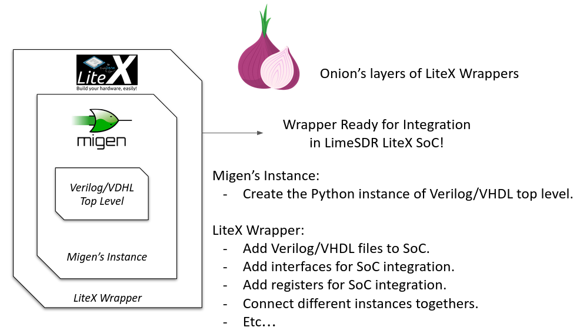

LiteX Basics
============

Introduction to LiteX in LimeSDR_GW
-----------------------------------
This document introduces the basics of **LiteX** as used in the **LimeSDR_GW** project. It covers
key concepts like platforms, targets, wrappers, naming conventions, and portability features.
LiteX is central to the project, providing a flexible, vendor-neutral framework for building SoCs.
If you're new to LiteX or need to understand its integration with LimeSDR_GW and LimeDFB, this is a
good starting point. For more on repository structure, see :doc:`project_structure`. For
advanced usage like adding boards, refer to :doc:`add_new_board`.

Overview of LiteX usage in LimeSDR_GW
^^^^^^^^^^^^^^^^^^^^^^^^^^^^^^^^^^^^^
.. figure:: images/limesdr_litex_logos.png
   :width: 800
   :align: center
   :alt: LimeSDR + LiteX

**LiteX** is an open-source SoC builder toolkit that uses Python to define, integrate, and assemble
FPGA-based systems. It automates challenging SoC components, such as bus interconnections,
clock/reset management, memory allocation, CPU integration, and firmware/toolchain compilation.

Unlike traditional HDL methods or proprietary tools like Vivado's Block Design, LiteX offers a
flexible, vendor-neutral workflow that seamlessly connects hardware and software.

Core features include:

- **Hardware Integration**: Connects modules, manages clock/reset domains, and handles system buses
  with minimal overhead.
- **CPU and Firmware Support**: Supports various soft-core processors (e.g., VexRiscv, LM32) and
  automates firmware builds (including linker scripts and BIOS).
- **Toolchain Automation**: Handles firmware and FPGA compilation pipelines—running synthesis,
  placement/routing, bitstream generation, and firmware builds with simple commands.
- **Vendor Neutrality**: Works with Intel, Xilinx, Lattice, and others through adaptable platform
  definitions.
- **Multi-Language Support**: Easily incorporates existing Verilog/VHDL components via wrappers.

The **LimeSDR_GW** repository uses LiteX to provide a consolidated gateware base for LimeSDR
variants (e.g., Mini V1/V2, XTRX). It replaces scattered HDL projects with a systematic,
sustainable LiteX-based SoC for SDR applications.

It incorporates the **LimeDFB** library (hosted on GitHub at myriadrf/LimeDFB), featuring modular
VHDL components for RF data processing (e.g., RX/TX paths for the LMS7002M). These modules are
reusable and adaptable for other RF transceivers.

Advantages of the LimeSDR_GW and LimeDFB approach include:

- **Reusability**: Shared RF and interface components (e.g., streaming engines, LMS7002M
  controllers) across all boards.
- **Sustainability**: A single, uniform architecture replaces fragmented per-board HDL branches.
- **Modularity**: Clear separation of RF processing (LimeDFB), SoC management (LiteX), and
  board-specific configs (platform/target).
- **Expandability**: Easy addition of new boards or variants by extending platform/target files,
  without duplicating logic.
- **Portability**: Greater flexibility for migrating to new FPGA families or upcoming LimeSDR
  versions.
- **Collaboration**: Standardized designs improve readability and reduce onboarding challenges for
  contributors.

This approach replaces isolated, board-specific HDL projects with a unified, scalable framework that
accelerates innovation while reducing technical debt.

Benefits of Using LiteX (in the Context of LimeSDR_GW)
^^^^^^^^^^^^^^^^^^^^^^^^^^^^^^^^^^^^^^^^^^^^^^^^^^^^^^
LiteX delivers substantial improvements to SDR gateware development within the LimeSDR_GW
ecosystem:

- **Unified SoC Framework**: Platforms like Mini V1/V2 and XTRX share a common blueprint,
  facilitating maintenance and consistent features across configurations.
- **Streamlined Board Setup**: Python-based platform and target scripts quickly define clocks, pin
  assignments, and memory layouts, eliminating custom HDL top-level files.
- **Reusable Host Interfaces**: PCIe and USB modules are modularized for reuse, minimizing
  redundant work.
- **Seamless Firmware Pipeline**: Integrating a soft CPU (e.g., VexRiscv or PicoRV32) requires
  minimal Python code, with LiteX handling firmware compilation, linker files, and deployment
  automatically.
- **Fast Prototyping Cycles**: Simultaneous hardware and software modifications in a single
  environment speed up development and debugging.
- **Cross-FPGA Portability**: Designs can be ported to different FPGA vendors (Xilinx, Intel,
  Lattice) by simply updating the platform definition and making minor vendor-specific adjustments.
- **Open Toolchain Support**: LiteX integrates with open-source FPGA tools (e.g., Yosys, Nextpnr)
  where possible, enabling fully transparent development workflows.

Before LiteX, LimeSDR boards used separate HDL projects dependent on vendor-specific tools.
Processor choices varied: MicroBlaze for Xilinx, Nios II for Intel, and LM32 for Lattice. Each had
unique firmware toolchains, memory maps, diagnostics, and flashing methods. Switching boards
required adapting to different environments, hindering code sharing and debugging consistency.

.. figure:: images/limesdr_design_flow.png
   :width: 800
   :align: center
   :alt: LiteSDR Design Flow

The LiteX-based LimeSDR_GW overcomes this fragmentation with a shared SoC structure, standardized
firmware management, and unified debugging tools. This greatly lowers barriers for adding new boards
or features, making development, validation, and collaboration far more efficient.

Understanding Core LiteX Concepts: Boards, Platforms, Targets
-------------------------------------------------------------
LiteX structures FPGA designs around three key concepts: **boards**, **platforms**, and **targets**.
Unlike traditional design flows, where these are spread across HDL source files, constraint
documents (e.g., `.xdc`, `.sdc`, or `.lpf`), and vendor-specific project settings, LiteX
centralizes them in Python scripts. This provides a portable, vendor-neutral, and toolchain-aware
method for specifying systems.

This section explains each concept, using the **LimeSDR Mini V2** as a real-world example.

.. figure:: images/limesdr_mini_v2.png
   :width: 600
   :align: center
   :alt: LiteSDR Mini V2

Platform = Board + Constraints
^^^^^^^^^^^^^^^^^^^^^^^^^^^^^^
In LiteX, the platform represents the physical hardware board and its constraints. Rather than
scattering pin assignments and timing specs across separate HDL and constraint files, LiteX
consolidates them into a single **platform Python file** (e.g., `limesdr_mini_v2_platform.py`).

This file includes:

- Definitions for all available I/Os (clocks, SPI, I2C, LMS7002M interfaces, USB FIFO, LEDs, etc.)
- Electrical characteristics (`IOStandard`, `Misc`, pull-up resistors, etc.)
- Timing constraints via methods like `add_period_constraint()`
- The FPGA device identifier
- Programming interface configuration (`create_programmer`)

LiteX parses this file to generate suitable project and constraint files for tools like Vivado,
Quartus, Diamond, or Yosys/Nextpnr.

LMS7002M I/O Block on LimeSDR Mini V2
^^^^^^^^^^^^^^^^^^^^^^^^^^^^^^^^^^^^^
This I/O definition specifies all signals connecting the FPGA to the LMS7002M transceiver, including
control lines, RX/TX digital data paths, and clock signals:

.. code-block:: python

    ("LMS", 0,
        # Control.
        Subsignal("RESET", Pins("A7")),
        Subsignal("CORE_LDO_EN", Pins("C6")),
        Subsignal("RXEN", Pins("D6")),
        Subsignal("TXEN", Pins("B7")),
        # RX Interface (LMS → FPGA).
        Subsignal("DIQ1_D", Pins("J2 L1 K1 K4 G3 F4 J1 H1 G4 F2 G1 H2")),
        Subsignal("TXNRX1", Pins("F1")),
        Subsignal("ENABLE_IQSEL1", Pins("F3")),
        Subsignal("MCLK1", Pins("H4")),
        Subsignal("FCLK1", Pins("H3")),
        # TX Interface (FPGA → LMS).
        Subsignal("DIQ2_D", Pins("A3 C2 A2 B4 C3 B2 D3 B1 A4 C1 C7 A6")),
        Subsignal("TXNRX2_or_CLK_SEL", Pins("B6")),
        Subsignal("ENABLE_IQSEL2", Pins("C4")),
        Subsignal("MCLK2", Pins("D2")),
        Subsignal("FCLK2", Pins("D1")),
        # Electrical standard.
        IOStandard("LVCMOS25")
    ),

This method replaces the conventional spread across a main HDL wrapper and multiple `.xdc`/`.lpf`/`.sdc` files.

Timing Constraints Generation
^^^^^^^^^^^^^^^^^^^^^^^^^^^^^
Main timing constraints related to hardware oscillators are defined programmatically in the
platform's `do_finalize()` function:

.. code-block:: python

    def do_finalize(self, fragment):
        self.add_period_constraint(self.lookup_request("LMK_CLK"), 1e9/40e6)
        self.add_period_constraint(self.lookup_request("FT_CLK"), 1e9/100e6)
        self.add_period_constraint(self.lookup_request("LMS:MCLK1"), 1e9/125e6)
        self.add_period_constraint(self.lookup_request("LMS:MCLK2"), 1e9/125e6)

LiteX then translates these into the appropriate format for the selected toolchain:

- `.lpf` for **Diamond**
- `.sdc` for **Nextpnr**
- `.xdc` for **Vivado**
- `.qsf` and `.sdc` for **Quartus**

As created in the user design, other timing constraints can also be added in the target. Timing
constraints directly derived from PLLs/MMCMs are generally automatically added by the tools if the
source constraint is defined, so there is generally no need to add them manually (The approach can
still depend on the toolchain and timing reports need to be verified after build).

Multiple Toolchain Support
^^^^^^^^^^^^^^^^^^^^^^^^^^
Since LiteX uses its own IO and timing constraints definitions and supports multiple toolchains when
available for the same FPGA family, switching between toolchains is simply a matter of changing the
toolchain argument.

The LimeSDR Mini V2 supports both **Lattice Diamond** and **Yosys + Nextpnr** workflows:

- The same Python platform file is used for both.
- LiteX generates the relevant build artifacts based on the specified toolchain.
- For example:
  - With ``--toolchain=diamond`` → `.ldf`, `.lpf`, VHDL-compatible sources
  - With ``--toolchain=trellis`` → `.json`, `.sdc`, `pcf`

This enables smooth switches between proprietary and open-source toolchains without duplicating
designs or constraints.

Target = SoC Top-Level + Flow Control
^^^^^^^^^^^^^^^^^^^^^^^^^^^^^^^^^^^^^
The *target* file (e.g., `limesdr_mini_v2.py`) serves as the main entry point. It manages:

- Instantiation of the platform class
- Initialization of the SoC core
- Connection of peripherals, memory regions, buses, and clock domains
- Integration of logic for the LMS7002M (via `LimeTop`), FT601 USB interface, SPI, I2C, and other
  components
- Addition of optional features like LiteScope analyzers or UARTBone

The same file can be used to build, load, or test a bitstream with different options:

.. code-block:: bash

    # Open-source toolchain build + load
    python3 -m boards.targets.limesdr_mini_v2 --toolchain=trellis --build --load
    # Diamond toolchain build + flash
    python3 -m boards.targets.limesdr_mini_v2 --toolchain=diamond --build --flash

How It All Fits Together
^^^^^^^^^^^^^^^^^^^^^^^^
- **Platform** = Unified Python representation of board I/O, constraints, and flashing method
- **Target** = Main SoC builder that handles system wiring
- **Toolchain files** = Automatically generated based on the platform and selected toolchain

This structure supports consistent, flexible designs across various LimeSDR boards and FPGA vendors,
removing the need to modify underlying HDL or constraint files.

.. _creating_litex_migen_wrappers:

Creating LiteX/Migen Wrappers
-----------------------------
Many modules in the LimeDFB repository are written in VHDL and need to be instantiated and managed
within LiteX's Python-based SoC environment. This is achieved using **LiteX/Migen wrappers**, which
define the VHDL module's interface, connect it to the SoC bus (e.g., via CSRs), and ensure smooth
inclusion in the FPGA build process.

   LiteX Wrapper onion layers :): At the core is the Verilog/VHDL Top Level module (e.g., a LimeDFB
   block). It is first instantiated using Migen to create a Python instance of the HDL top level.
   The LiteX wrapper then adds portability features, such as Verilog/VHDL file inclusion in the SoC,
   IO connections/stream interfaces, CSR registers for firmware control, and connections to
   different SoC instances. This modular layering ensures seamless integration and reuse across FPGA
   vendors and designs.

This section shows how to create such a wrapper, using the `gpio_top` module as a practical
example.

Example: Wrapping the GPIO Module
^^^^^^^^^^^^^^^^^^^^^^^^^^^^^^^^^
The GPIO module is implemented in VHDL in the file:

``LimeDFB/gpio_top/src/gpio_top.vhd``

To make it LiteX-compatible, a Python wrapper is created in:

``gateware/gpio_top.py``

This wrapper does the following:

1. **Defines a LiteX module** (`GpioTop`), inheriting from `LiteXModule`.
2. **Specifies the interface** using `Signal` objects, such as `GPIO_DIR`, `GPIO_OUT_VAL`, and
   `GPIO_IN_VAL`.
3. **Creates CSRs** with `CSRStorage`/`CSRStatus` to expose control and status registers to
   firmware.
4. **Instantiates the VHDL module** using Migen’s `Instance(...)`, linking signals and parameters.
5. **Adds bidirectional buffering** with FPGA-specific primitives (e.g., Xilinx `IOBUF`).
6. **Adds the VHDL source** to the build via `platform.add_source(...)`.

Illustrative code snippet:

.. code-block:: python

    class GpioTop(LiteXModule):
        def __init__(self, platform, pads):
            # Define internal signals for the GPIO interface (e.g., direction, output value, input value)
            self.GPIO_DIR = Signal(len(pads))
            self.GPIO_OUT_VAL = Signal(len(pads))
            self.GPIO_IN_VAL = Signal(len(pads))
            # Create CSRs to expose GPIO controls (override, direction, value) and status to firmware
            self.gpio_override = CSRStorage(len(pads))
            self.gpio_override_dir = CSRStorage(len(pads))
            self.gpio_override_val = CSRStorage(len(pads))
            self.gpio_val = CSRStatus(len(pads))
            # Internal signals for bidirectional I/O buffering
            self._pads = Signal(len(pads))
            self.GPIO_I = Signal(len(pads))
            self.GPIO_O = Signal(len(pads))
            self.GPIO_T = Signal(len(pads))
            # Combinatorial assignments: connect status CSR to input value and pads to internal pads signal
            self.comb += [
                self.gpio_val.status.eq(self.GPIO_IN_VAL),
                pads.eq(self._pads),
            ]
            # Instantiate the VHDL module using Migen's Instance, linking Python signals to VHDL ports and parameters
            self.specials += Instance("gpio_top",
                p_G_GPIO_WIDTH = len(pads),
                i_GPIO_DIR = self.GPIO_DIR,
                i_GPIO_OUT_VAL = self.GPIO_OUT_VAL,
                o_GPIO_IN_VAL = self.GPIO_IN_VAL,
                i_GPIO_OVERRIDE = self.gpio_override.storage,
                i_GPIO_OVERRIDE_DIR = self.gpio_override_dir.storage,
                i_GPIO_OVERRIDE_VAL = self.gpio_override_val.storage,
                i_GPIO_I = self.GPIO_I,
                o_GPIO_O = self.GPIO_O,
                o_GPIO_T = self.GPIO_T
            )
            # Add vendor-specific bidirectional buffering (e.g., IOBUF for Xilinx) for each pad
            for n in range(len(pads)):
                self.specials += Instance("IOBUF",
                    o_O = self.GPIO_I[n],
                    io_IO = self._pads[n],
                    i_I = self.GPIO_O[n],
                    i_T = self.GPIO_T[n]
                )
            # Add the VHDL source file to the platform's build sources for synthesis
            platform.add_source("./gateware/LimeDFB/gpio_top/src/gpio_top.vhd")

General Pattern
^^^^^^^^^^^^^^^
This approach applies to other LimeDFB modules or external HDL IP, as long as their interfaces are
clearly defined and suitable for wrapping.

It broadly supports cores in:

- VHDL
- Verilog/SystemVerilog
- Amaranth
- SpinalHDL
- Chisel

For a detailed tutorial on wrapping external cores in LiteX, see:
https://github.com/enjoy-digital/litex/wiki/Reuse-a-(System)Verilog,-VHDL,-Amaranth,-Spinal-HDL,-Chisel-core

This modular, language-agnostic method allows engineers to integrate custom IP into a LiteX SoC
with minimal effort, leveraging LiteX’s robust tooling and cross-platform features.
