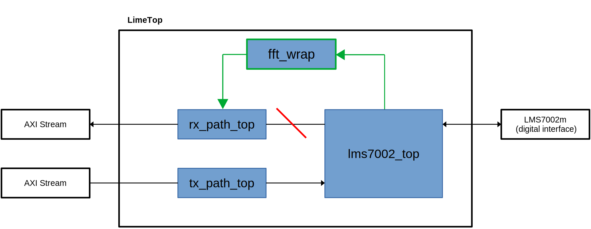
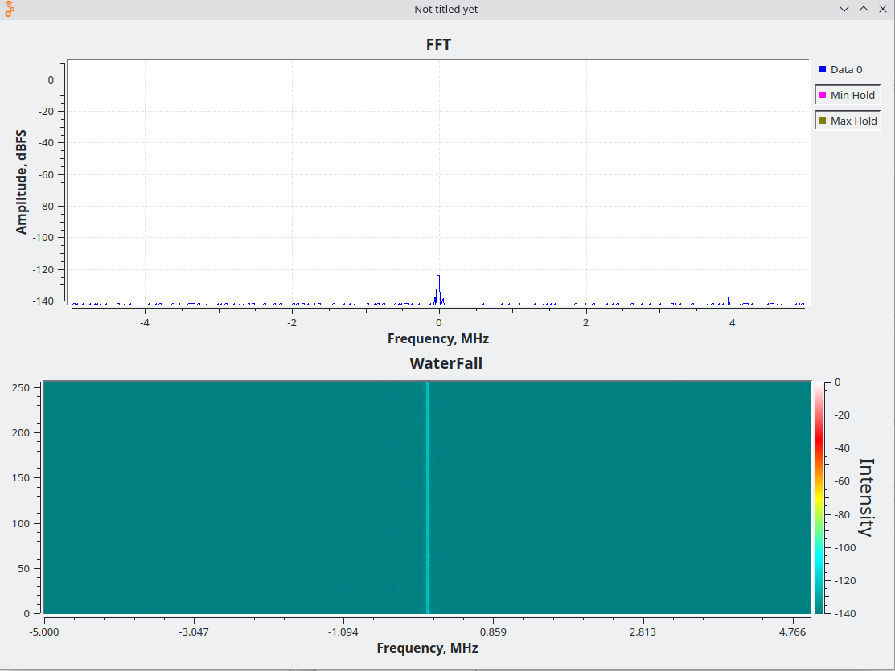

Modifying the Project
=====================

This section describes how to modify the gateware and firmware of the project. It explains where the source files are located and provides an example of adding a custom module (a fixed-point FFT) to the LimeSDR XTRX design.

Gateware
--------
The gateware sources are organized into several folders:

- **boards/targets**
  Python LiteX files that contain board-specific top-level gateware descriptions.
- **boards/platforms**
  Python LiteX files that define platform constraints, such as pin locations and I/O standards.
- **gateware**
  HDL source files and module descriptions.

Example: Adding an FFT Module
-----------------------------
To make it easier to understand how to add a custom module, an example is provided for the LimeSDR XTRX. In this example, a fixed-point FFT module is inserted in the data receive path so that the results of the Fourier transform are packed into packets instead of raw RF samples.

If you want to try out the FFT module without modifying code, you could build the target with the following command:

.. code-block:: bash

   python3 -m boards.targets.limesdr_xtrx --build --with-fft [--load] [--write] [--cable <cable>]

All sources required for the example are located in **gateware/examples/fft**. The folder contains:

- **fixedpointfft.py**
  A modified fixed-point FFT module based on the `amlib`_ repository.
- **fft.v**
  The Verilog source file (pre-generated from **fixedpointfft.py**).
- **fft_wrap.vhd**
  A VHDL wrapper for **fft.v** that provides a basic AXI-STREAM interface.
- **LimeTop_fft.py**
  A modified version of **LimeTop.py** used in the project, incorporating the FFT module.
- **limesdr_fft_samples.grc**
  A GNU Radio file containing blocks that scale, shift, and display the FFT data received from the board.

In the standard design (see the `LimeSDR XTRX gateware description`_), raw samples are received by **lms7002_top** and then passed to **rx_path_top** for packetization. To reuse this logic and insert the FFT module, the FFT module should be placed between **lms7002_top** and **rx_path_top**.

Below is a block diagram showing the desired structure. New elements are highlighted in green, and elements to be removed are marked in red.

Disconnecting Existing Connections
~~~~~~~~~~~~~~~~~~~~~~~~~~~~~~~~~~

To avoid conflicting assignments, you must disconnect the **lms7002_top** master interface from the **rx_path_top** slave interface. For example, in **gateware/LimeTop.py**, comment out the connection line as shown:

.. code-block:: python

    # LMS7002 -> RX Path -> PCIe DMA Pipeline.
    # Disconnect RX path AXIS slave from LMS7002 AXIS master
    #self.rx_pipeline = stream.Pipeline(
    #    self.lms7002_top.source,
    #    self.rxtx_top.rx_path.sink,
    #)
    # LMS7002 -> RX Path -> PCIe DMA Pipeline.
    self.rx_pipeline = stream.Pipeline(
        self.lms7002_top.source,
        self.rxtx_top.rx_path.sink,
    )

    # VCTCXO -----------------------------------------------------------------------------------

Instantiating the FFT Wrapper
~~~~~~~~~~~~~~~~~~~~~~~~~~~~~

Next, instantiate the FFT wrapper and create two new AXI-Stream interfaces. You can copy the interface declarations from another module. For example:

.. code-block:: python

    # Import the AXIStreamInterface definition
    from litex.soc.interconnect.axi import AXIStreamInterface

    # define Reset signal and adds a MultiReg
    fft_reset_n = Signal()
    self.specials += MultiReg(self.fpgacfg.tx_en, fft_reset_n, odomain=self.lms7002_top.source.clock_domain)

    # Declare FFT AXI Stream interfaces.
    self.fft_s_axis = AXIStreamInterface(data_width=64, clock_domain=self.lms7002_top.source.clock_domain)
    self.fft_m_axis = AXIStreamInterface(data_width=64, clock_domain=self.lms7002_top.source.clock_domain)

Adding Sources and Instantiating the FFT Module
~~~~~~~~~~~~~~~~~~~~~~~~~~~~~~~~~~~~~~~~~~~~~~~

Add the FFT sources to the project and instantiate the module as follows:

.. code-block:: python

    # Instantiate the FFT wrapper.
    self.specials += Instance("fft_wrap",
        i_CLK           = ClockSignal(self.lms7002_top.source.clock_domain),
        i_RESET_N       = fft_reset_n,
        i_S_AXIS_TVALID = self.fft_s_axis.valid,
        i_S_AXIS_TDATA  = self.fft_s_axis.data,
        o_S_AXIS_TREADY = self.fft_s_axis.ready,
        i_S_AXIS_TLAST  = self.fft_s_axis.last,
        i_S_AXIS_TKEEP  = self.fft_s_axis.keep,
        o_M_AXIS_TDATA  = self.fft_m_axis.data,
        o_M_AXIS_TVALID = self.fft_m_axis.valid,
        i_M_AXIS_TREADY = self.fft_m_axis.ready,
        o_M_AXIS_TLAST  = self.fft_m_axis.last,
        o_M_AXIS_TKEEP  = self.fft_m_axis.keep,
    )
    # Add FFT sources to the platform.
    platform.add_source("./gateware/examples/fft/fft.v")
    platform.add_source("./gateware/examples/fft/fft_wrap.vhd")

Connecting the FFT Module
~~~~~~~~~~~~~~~~~~~~~~~~~

Finally, connect the FFT module between **lms7002_top** and **rx_path_top**. Use the same connection syntax as before (with the added *omit={"areset_n"}* for the FFT wrapper):

.. code-block:: python

    # LMS7002 -> FFT -> RX Path -> PCIe DMA Pipeline.
    # Connect the LMS7002 master interface to the FFT wrapper slave interface
    self.comb += self.lms7002_top.source.connect(self.fft_s_axis)
    # Connect the FFT wrapper master interface to the RX path slave interface
    self.comb += self.fft_m_axis.connect(self.rxtx_top.rx_path.sink)

After these modifications, build the project and program the board as described in :ref:`Building the project<docs/build_project:building and loading the gateware>`.

The FFT results can be observed using the **limesdr_fft_samples.grc** file provided with the example. Ensure that you have up-to-date versions of GNU Radio and LimeSuiteNG installed.

.. _amlib: https://github.com/amaranth-farm/amlib
.. _LimeSDR XTRX gateware description: https://limesdrgw.myriadrf.org/docs/limesdr_xtrx
.. _LiteX documentation: https://github.com/enjoy-digital/litex/wiki/Reuse-a-(System)Verilog,-VHDL,-Amaranth,-Spinal-HDL,-Chisel-core

Firmware
--------
The firmware sources are located in the ``firmware`` folder and are built using the provided ``Makefile``. The gateware project must be built at least once to generate the necessary sources and headers for firmware compilation. When the gateware is built, the firmware is automatically compiled, so manual compilation is not required.

Debug Tools
-----------
**Firmware Debug through GDB over JTAG**

To build and load a gateware with a debug interface, run:

.. code-block:: bash

    ./limesdr_xtrx.py --with-bscan --build --load --flash

Then, load the firmware through serial:

.. code-block:: bash

    litex_term /dev/ttyUSBx --kernel firmware/firmware.bin

Run OpenOCD with one of the configurations:

.. code-block:: bash

    openocd -f ./digilent_hs2.cfg -c "set TAP_NAME xc7.tap" -f ./riscv_jtag_tunneled.tcl
    # or
    openocd -f ./openocd_xc7_ft2232.cfg -c "set TAP_NAME xc7.tap" -f ./riscv_jtag_tunneled.tcl

Finally, connect GDB for debugging:

.. code-block:: bash

    gdb-multiarch -q firmware/firmware.elf -ex "target extended-remote localhost:3333"

For a more user-friendly debugging experience, you can also configure Eclipse IDE. Refer to the guide:
`Using Eclipse to run and debug the software <https://github.com/SpinalHDL/VexRiscv?tab=readme-ov-file#using-eclipse-to-run-and-debug-the-software>`_.
