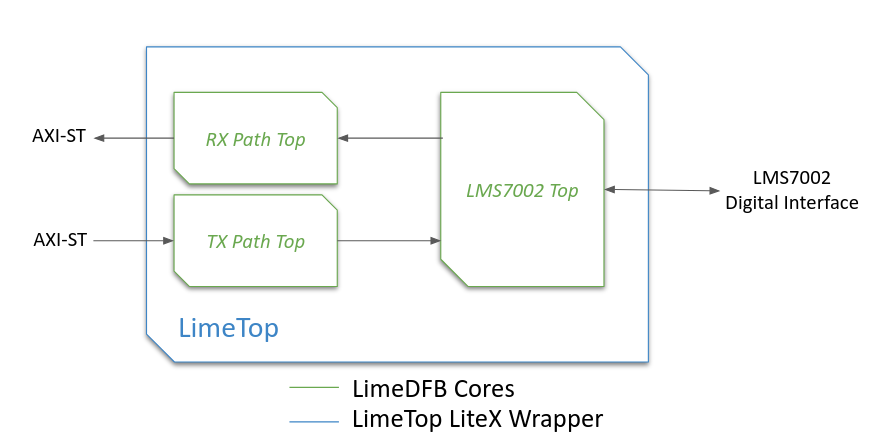

Project Structure
=================

Overview
--------
This page provides a detailed overview of the two main repositories at the heart of the unified
LimeSDR gateware project:

- **LimeSDR_GW** – the primary LiteX-based SoC framework, covering board/platform/target
  definitions, SoC integration, bitstream generation, and firmware compilation.
- **LimeDFB** – the modular VHDL-focused signal processing library (Data Flow Blocks), designed for
  reusability and integration with LiteX via the `LimeDFB_LiteX` wrapper layer.

The structure is designed to promote modularity, reusability, and portability across diverse FPGA
architectures and SDR boards. By leveraging **LiteX**'s Python-based SoC builder toolkit, the
project automates complex hardware integration tasks (e.g., bus connections, clock management, CPU
and firmware support), allowing a focus on RF-specific functionalities. **LimeDFB** complements
this by providing modular VHDL components for RF data processing, ensuring a clear separation of
concerns: **LiteX** handles SoC assembly and vendor-neutral abstractions, **LimeSDR_GW** unifies
board-specific configurations, and **LimeDFB** manages reusable RF logic.

This organization replaces isolated, board-specific HDL projects with a consolidated, sustainable
ecosystem. It simplifies maintenance by sharing components (e.g., streaming engines, LMS7002M
controllers) across boards, enables easy expansion for new variants without logic duplication, and
supports migration to different FPGA families. For a high-level project overview, refer to the
:ref:`Introduction` page. When preparing to add or modify boards, fork/clone the repository
and use existing platform/target files as templates (e.g., copy from LimeSDR Mini V2 for similar
setups). For details on extending the project (e.g., adding boards or features), see
:doc:`add_new_board`.

LimeSDR_GW Repository Layout
----------------------------
The `LimeSDR_GW` repository (hosted on GitHub at `myriadrf/LimeSDR_GW
<https://github.com/myriadrf/LimeSDR_GW>`_) is built around the LiteX design flow and includes the
following core components:

.. code-block:: bash

   / (root)
   ├── boards/
   │   ├── platforms/      <-- Board-specific I/O constraints and configuration files (e.g., pin assignments, timing constraints, FPGA device definitions, programming setups).
   │   └── targets/        <-- Integration scripts that define the build process (instantiating LiteX cores, peripherals, CPU, and firmware). These act as the "top-level" for SoC wiring and flow control, including clock/reset domains, memory layouts, and optional features like debugging.
   ├── docs/               <-- Documentation (design descriptions, build instructions, modification guidelines, etc.).
   ├── firmware/           <-- Firmware source code for the softcore CPU (drivers and application-specific logic).
   ├── gateware/           <-- FPGA hardware description files (Verilog/VHDL/LiteX) for custom logic and interconnects, including wrappers for integrating LimeDFB modules.
   ├── riscv_jtag_tunneled.tcl  <-- TCL script for automating JTAG debugging.
   ├── README.md           <-- Project overview and documentation links.
   └── .gitignore          <-- Files and directories ignored by version control.

Key directories include:

- ``boards/platforms/``
  Physical hardware board definitions (with I/O assignments and constraints). Each board (e.g.,
  `limesdr_mini_v2_platform.py`) defines a Platform that combines IOs with timing constraints.
  LiteX uses this to automatically generate toolchain-specific constraint files (for Vivado,
  Quartus, Diamond, and others).

- ``boards/targets/``
  Main SoC entry points (e.g., `limesdr_mini_v2.py`), which instantiate a board-customized
  `LimeTop` SoC. This acts as the central point for CPU integration, peripheral connections, and
  combining LiteX with DFB modules.

- ``gateware/``
  Contains LiteX integration logic and wrappers for external HDL. Notable items include:

  - ``LimeTop.py`` – core SoC management
  - ``LimeDFB/`` – submodule or link to the LimeDFB repository (with raw VHDL)
  - ``LimeDFB_LiteX/`` – LiteX-compatible VHDL wrappers for DFB modules
  - ``examples/fft/`` – simple examples (e.g., FFT-based loopback tests)
  - ``constraints/`` – additional static timing constraints (e.g., `.sdc` files)

- ``firmware/``
  C-based firmware for RISC-V softcores (e.g., VexRiscv, PicoRV32). Includes:

  - `main.c`, peripheral drivers, and build setup (`Makefile`)
  - Standard interfaces (for I2C, SPIFlash, LMS7002M configuration, etc.)
  - Shared across all boards and CPU types

- ``bitstream/``
  Pre-built FPGA bitstreams for supported boards, created through LiteX's toolchain abstraction.

- ``tools/``
  GNU Radio Companion (GRC) and Python scripts for validation (e.g., testing TX/RX paths on Mini V2
  or XTRX boards).

- ``docs/``
  Sphinx-based documentation, with board-specific build instructions and diagrams.

LimeDFB Repository Layout
-------------------------
The `LimeDFB` repository (hosted on GitHub at `myriadrf/LimeDFB
<https://github.com/myriadrf/LimeDFB>`_) contains reusable VHDL signal processing blocks, organized
by function and supported by detailed documentation. For full details, see `LimeDFB documentation
<https://limedfb.myriadrf.org>`_. It is designed for reusability and integration with LiteX via the
*LimeDFB_LiteX* wrapper layer.

.. code-block:: bash

   / (root)
   ├── axis/               <-- Shared utilities (e.g., AXI-Stream converters).
   ├── axis_fifo/          <-- FIFO buffers for data streams.
   ├── cdc/                <-- Clock domain crossing modules.
   ├── docs/               <-- Architecture overviews, WaveDrom waveforms, and in-depth module explanations.
   ├── gt_channel/         <-- Gigabit transceiver channel modules.
   ├── lms7002/            <-- LMS7002M transceiver controllers.
   ├── rx_path_top/        <-- Receive path top modules.
   ├── tx_path_top/        <-- Transmit path top modules.
   ├── README.md           <-- Repository overview and links.
   └── .gitignore          <-- Files ignored by version control.

Key directories include:

- ``rx_path_top/``, ``tx_path_top/``, ``lms7002/``, ``gt_channel/``
  Specific signal paths and controllers, each with `src/` for code, testbenches for verification,
  and block diagrams for clarity.

- ``docs/``
  Architecture overviews, WaveDrom waveforms, and in-depth module explanations.

- ``axis/``, ``axis_fifo/``, ``cdc/``
  Shared utilities (e.g., clock domain crossing, FIFO buffers, AXIS converters).

- ``LimeTop wrappers`` in ``tx_path_top.py``, ``rx_path_top.py``, etc.
  These wrap DFB logic as LiteX modules, reused in `LimeSDR_GW/gateware/LimeDFB_LiteX`.

Integration Between Repos
^^^^^^^^^^^^^^^^^^^^^^^^^

LiteX manages the build process and incorporates LimeDFB modules through the `LimeDFB_LiteX` wrapper layer. This separation keeps DSP logic vendor-neutral and purely VHDL-based, while allowing smooth interaction with LiteX's Python-driven SoC and firmware environment.

Examples include:

- The `LimeTop` SoC instantiates `RxPathTop`, `TxPathTop`, and `LMS7002Top` from `LimeDFB_LiteX`.
- Firmware uses a consistent memory map to access DFB control and status registers.
- The same logic can be synthesized for Intel (via Quartus), Xilinx (via Vivado), or Lattice (via Diamond/Yosys) without changes to the VHDL or Python code.

The `LimeTop` block diagram illustrates the integration of LimeDFB cores (in green) with LiteX wrappes (in blue). AXI-Stream interfaces connect the RX and TX Path Top blocks to the LMS7002 Top, which interfaces with the LMS7002 digital interface. This modular setup allows RF data processing in LimeDFB while LiteX handles SoC-level connectivity and control.

Additional Files
----------------

**riscv_jtag_tunneled.tcl** (in LimeSDR_GW)
  - A TCL script used for automating JTAG debugging with the RISC-V softcore. It streamlines tasks
    such as setting breakpoints and managing JTAG connections.

**README.md** (in both repositories)
  - Provides an introduction to the project, build instructions, and links to additional
    documentation.

**.gitignore** (in both repositories)
  - Lists files and directories that should be ignored by version control (e.g., temporary files and
    build outputs).
