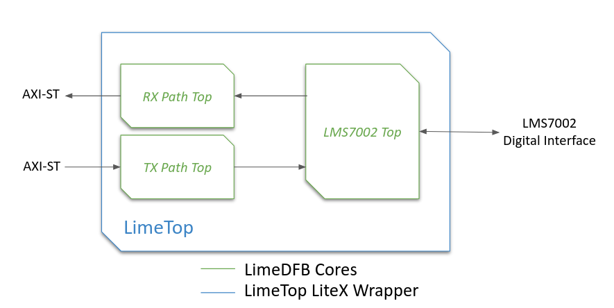

Project Structure
=================

This page explains how the unified LimeSDR gateware project is organized across its two main repositories:

- **LimeSDR_GW** – the top-level LiteX-based SoC project
- **LimeDFB** – the reusable VHDL signal-processing library

Together, these repositories separate **system integration** from **signal-processing logic**. This keeps the design modular, reusable, and portable across multiple FPGA families and SDR platforms.

At a Glance
-----------

.. list-table::
   :widths: 20 35 45
   :header-rows: 1

   * - Repository
     - Primary role
     - Main contents
   * - ``LimeSDR_GW``
     - System integration and build flow
     - Board definitions, LiteX targets, SoC integration, firmware, bitstream generation, documentation
   * - ``LimeDFB``
     - Reusable signal-processing library
     - VHDL DSP blocks, LMS7002M-related modules, AXI-Stream utilities, architecture documentation

In practical terms:

- **LiteX** provides the SoC construction framework
- **LimeSDR_GW** defines how a specific board is built and assembled
- **LimeDFB** provides reusable RF and DSP building blocks

This organization replaces isolated board-specific HDL projects with a shared and maintainable development model.

LimeSDR_GW Repository
---------------------

The `LimeSDR_GW <https://github.com/myriadrf/LimeSDR_GW>`_ repository is the main integration layer of the project. It is responsible for board support, SoC construction, firmware integration, and FPGA build flow management.

Repository layout
^^^^^^^^^^^^^^^^^

.. code-block:: text

   / (root)
   ├── boards/
   │   ├── platforms/
   │   └── targets/
   ├── docs/
   ├── firmware/
   ├── gateware/
   ├── riscv_jtag_tunneled.tcl
   ├── README.md
   └── .gitignore

Important directories
^^^^^^^^^^^^^^^^^^^^^

``boards/platforms/``
  Board-specific platform definitions, including FPGA device selection, pin assignments, and timing or toolchain constraints.

``boards/targets/``
  Top-level build targets that assemble the LiteX SoC for a specific board. These files define clocking, CPU integration, memory layout, peripherals, and optional features.

``gateware/``
  Custom FPGA logic and integration wrappers. This includes LiteX-facing wrappers for external HDL modules and project-specific hardware components.

``firmware/``
  Firmware for the softcore CPU, including low-level drivers and board-independent application code.

``docs/``
  Sphinx documentation, including build instructions, architecture notes, and developer guides.

Typical role in the build flow
^^^^^^^^^^^^^^^^^^^^^^^^^^^^^^

``LimeSDR_GW`` is the repository you work in when you:

- build gateware for a supported board
- modify SoC integration
- add or configure peripherals
- compile firmware
- add support for a new platform or target

LimeDFB Repository
------------------

The `LimeDFB <https://github.com/myriadrf/LimeDFB>`_ repository contains reusable VHDL signal-processing modules used by the unified gateware project. It is designed to remain modular and largely vendor-neutral.

For complete module-level documentation, see the `LimeDFB documentation <https://limedfb.myriadrf.org>`_.

Repository layout
^^^^^^^^^^^^^^^^^

.. code-block:: text

   / (root)
   ├── axis/
   ├── axis_fifo/
   ├── cdc/
   ├── docs/
   ├── gt_channel/
   ├── lms7002/
   ├── rx_path_top/
   ├── tx_path_top/
   ├── README.md
   └── .gitignore

Important directories
^^^^^^^^^^^^^^^^^^^^^

``rx_path_top/`` and ``tx_path_top/``
  Top-level receive and transmit processing chains.

``lms7002/``
  LMS7002M-related digital interface and control modules.

``axis/``, ``axis_fifo/``, ``cdc/``
  Shared infrastructure modules such as AXI-Stream helpers, FIFOs, and clock-domain-crossing components.

``docs/``
  Architecture overviews, diagrams, timing illustrations, and module documentation.

Typical role in the build flow
^^^^^^^^^^^^^^^^^^^^^^^^^^^^^^

``LimeDFB`` is the repository you work in when you:

- develop or modify reusable DSP blocks
- update RF data-path modules
- improve shared VHDL infrastructure
- verify signal-processing building blocks independently of board-specific integration

How the Repositories Work Together
----------------------------------

The two repositories are connected through a wrapper-based integration model:

- **LimeDFB** contains the reusable VHDL modules and LiteX wrappers
- **LimeSDR_GW** contains the LiteX-based SoC and board integration

This allows the same signal-processing logic to be reused across different FPGA vendors and boards, while keeping the SoC assembly flow consistent.

Typical examples include:

- ``LimeTop`` instantiating receive, transmit, and LMS7002M-related blocks through LiteX-compatible wrappers
- firmware accessing control and status registers through a consistent memory map
- the same hardware design being built with Vivado, Quartus, or Lattice-based flows without redesigning the DSP modules

   Example of LiteX and LimeDFB integration inside ``LimeTop``. LimeDFB cores implement the RF processing logic, while LiteX wrappers connect them to the SoC infrastructure and control path.

Other Important Files
---------------------

.. list-table::
   :widths: 25 75
   :header-rows: 1

   * - File
     - Purpose
   * - ``riscv_jtag_tunneled.tcl``
     - Helper script for JTAG-based debugging of the RISC-V softcore.
   * - ``README.md``
     - High-level project introduction and links to the main documentation.
   * - ``.gitignore``
     - Defines generated files and build outputs that should not be tracked by version control.

See Also
--------

- :doc:`quick_start`
- :doc:`add_new_board`