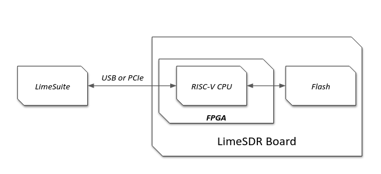

Update and Recovery
===================

This section describes the process for updating the FPGA gateware (bitstream). Updates focus on
flashing the bitstream to non-volatile storage (Flash), enabling the FPGA to load it automatically
on power-up. The soft CPU firmware handles update commands from the host, with LimeSuite as the
primary tool for managing the process on the host side.

Overview
--------

Firmware updates use the host interfaces (USB or PCIe) to transfer bitstream data to the soft CPU
firmware, which then manages writing to Flash. This ensures updates are persistent and reduces the
need for volatile loads. Key concepts include:

- **Firmware Role**: The soft CPU (e.g., VexRiscv) acts as an intermediary, processing host commands
  to erase Flash sectors, program pages, and handle data integrity.
- **LimeSuite Communication**: The host tool (LimeSuite) initiates updates, sending commands and
  bitstream data in segments over the interface, with firmware responding with statuses (e.g.,
  success or error).
- **Multiboot Support**: Allows multiple bitstream images in Flash (e.g., a reliable "golden" image
  and an update image), with automatic fallback on failure for recovery.
- **Portability**: LiteX abstracts Flash access (via LiteSPI), making the mechanism consistent
  across boards and FPGA vendors.

This approach minimizes risks during updates and supports shared firmware across all LimeSDR
variants.

Update Process
--------------

Updates are typically performed using LimeSuite (e.g., via `LimeUtil --update` or GUI features):

- LimeSuite connects to the board over USB/PCIe and sends update commands along with bitstream data
  in segments.
- The firmware receives these via control endpoints, validates the data, erases relevant Flash
  areas, and writes the bitstream.
- Additional handling for non-volatile data like VCTCXO DAC values or serial numbers, stored in
  specific Flash offsets.

For USB-based boards (Mini V1/V2), this uses FT601; for PCIe (XTRX), it leverages LitePCIe.

Multiboot Across FPGAs
----------------------

Multiboot enables safe updates by supporting multiple images in Flash:

- Store a golden image at the base address and updates at an offset.
- On power-up, the FPGA loads the primary image; if it fails (e.g., due to corruption), it falls
  back to the golden one automatically.
- Vendor differences (e.g., Intel MAX10 uses CFM partitions, Lattice ECP5 uses configuration
  registers, Xilinx Artix-7 uses ICAP) are handled transparently, with firmware setting boot flags
  or addresses.

This provides robustness, especially for remote or field updates.

Testing and Recovery
--------------------

- Post-update verification via LimeSuite (e.g., check firmware version or run diagnostics like
  LimeQuickTest).
- If issues arise, multiboot falls back to the golden image; JTAG serves as a last-resort recovery.
- Use tools like LiteScope for debugging Flash interactions during development.
