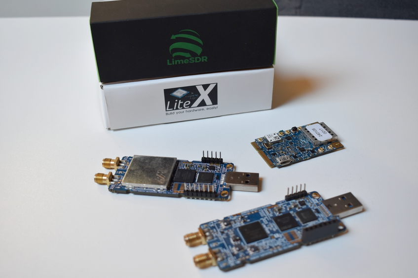
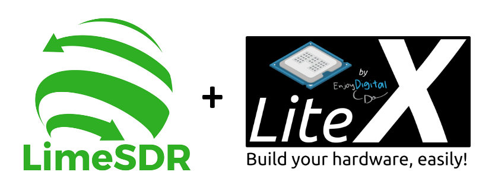

.. toctree::
   :maxdepth: 3
   :hidden:

   Introduction <self>
   docs/quick_start
   docs/project_structure
   docs/gateware_overview
   docs/litex_basics
   docs/modify_project
   docs/add_new_board
   docs/best_practices

Introduction
============

Project Overview
----------------
LimeSDR_GW provides gateware and firmware for the LimeSDR family of Software Defined Radio (SDR)
boards. The gateware implements FPGA-side data movement, processing, and hardware integration,
while the firmware runs on the embedded CPU for control, configuration, and board management.

The repository combines LiteX and LimeDFB into a unified development framework for multiple
LimeSDR platforms, including boards such as LimeSDR Mini V1/V2 and LimeSDR XTRX. It replaces
separate board-specific HDL projects with a more structured and maintainable architecture that
emphasizes reuse, portability, and long-term sustainability.

The repository is organized around a modular structure: board-specific definitions are placed in
``platforms/`` and ``targets/``, reusable FPGA logic is implemented in ``gateware/``, and CPU-side
software is located in ``firmware/``. This organization makes it easier to maintain existing
designs, add support for new boards, and extend the system with additional RF or DSP features.

Core Framework: LiteX
---------------------
The project is built around the **LiteX** framework, an open-source Python-based toolkit for
building FPGA SoC designs. LiteX automates common integration tasks such as interconnect creation,
clock/reset management, memory integration, CPU integration, and firmware build support. This lets
developers focus on SDR-specific functionality instead of repetitive SoC infrastructure work.

Key LiteX advantages in this project include:

- Support for multiple FPGA families and toolchains, improving portability across hardware targets.
- Integration with soft-core CPUs such as **VexRiscv**.
- Straightforward wrapping and reuse of existing Verilog and VHDL modules.

Overall, LiteX helps improve code reuse, portability, and maintainability across supported boards.

RF Processing: LimeDFB
----------------------
The **LimeDFB** library complements LiteX by providing modular VHDL blocks for RF data processing,
including receive (RX) and transmit (TX) paths for transceivers such as the LMS7002M used on
LimeSDR boards. By separating RF processing logic into reusable standalone components, LimeDFB
reduces code duplication and simplifies maintenance across multiple board variants.

Its main benefits include:

- Easier integration of new RF or DSP features.
- Better organization of complex signal-processing chains.
- Reusable building blocks that can be adapted to other platforms and transceivers.

Documentation Overview
----------------------
This documentation is organized into several sections:

**Quick Start Guide** :doc:`docs/quick_start`
  Use this section to set up the build environment, compile gateware and firmware, and program a
  supported board.

**Project Structure** :doc:`docs/project_structure`
  Use this section to understand how the repository is organized and how LiteX and LimeDFB fit
  together.

**Gateware Overview** :doc:`docs/gateware_overview`
  Refer to this section for architecture, interfaces, toolchains, update/recovery flow, and
  links to board-specific gateware documentation.

**LiteX Basics** :doc:`docs/litex_basics`
  Refer to this section for an introduction to the LiteX concepts used in LimeSDR_GW, including
  platforms, targets, wrappers, naming conventions, and portability guidelines.

**Modifying the Project** :doc:`docs/modify_project`
  Use this section when customizing the design, for example by adding new gateware modules or
  modifying firmware components.

**Adding a New Board** :doc:`docs/add_new_board`
  Refer to this section for step-by-step guidance on adding support for a new hardware platform.

**Best Practices** :doc:`docs/best_practices`
  Use this section for naming conventions, portability recommendations, and general development
  guidelines.

If you find gaps or inaccuracies in the documentation, please open an issue or contribute
improvements through GitHub.

Supported Boards
----------------

.. list-table:: Table 1. Supported Boards
   :header-rows: 1
   :widths: 20 15 25 40

   * - **Board**
     - **HW Version**
     - **Description**
     - **Toolchain**
   * - LimeSDR XTRX
     - v1.2+
     - Mini PCIe SDR board
     - Xilinx Vivado
   * - LimeSDR Mini V1
     - v1.x
     - USB SDR board
     - Intel Quartus
   * - LimeSDR Mini V2
     - v2.x
     - USB SDR board
     - Open-source flow with GHDL, Yosys, and nextpnr
   * - HiperSDR-44xx
     - v2
     - PCIe SDR board
     - Xilinx Vivado
   * - sSDR
     - rev 2
     - PCIe SDR board
     - Xilinx Vivado

Tooling
-------
The project prefers **open-source** tools where practical, especially for simulation, synthesis,
place-and-route, and programming flows on supported open toolchain targets. Some boards currently
rely on vendor toolchains such as Vivado or Quartus.

Development is primarily performed on **Linux**, where the supported tools integrate most smoothly.

.. table:: Table 2. Common Open-Source Tools

   +----------------------+------------------------------------------------------------+
   | **Tool**             | **Link**                                                   |
   +======================+============================================================+
   | GHDL                 | https://github.com/ghdl/ghdl                               |
   +----------------------+------------------------------------------------------------+
   | LiteX                | https://github.com/enjoy-digital/litex                     |
   +----------------------+------------------------------------------------------------+
   | nextpnr              | https://github.com/YosysHQ/nextpnr                         |
   +----------------------+------------------------------------------------------------+
   | prjtrellis           | https://github.com/YosysHQ/prjtrellis                      |
   +----------------------+------------------------------------------------------------+
   | OpenFPGALoader       | https://github.com/trabucayre/openFPGALoader               |
   +----------------------+------------------------------------------------------------+
   | OpenOCD              | https://openocd.org/                                       |
   +----------------------+------------------------------------------------------------+
   | VexRiscv             | https://github.com/SpinalHDL/VexRiscv                      |
   +----------------------+------------------------------------------------------------+
   | Yosys                | https://github.com/YosysHQ/yosys                           |
   +----------------------+------------------------------------------------------------+

These tools cover tasks such as simulation, synthesis, place-and-route, device programming, and
debugging.
