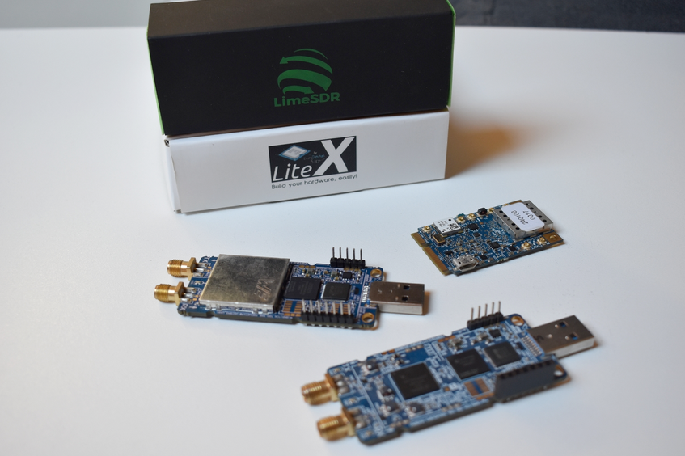
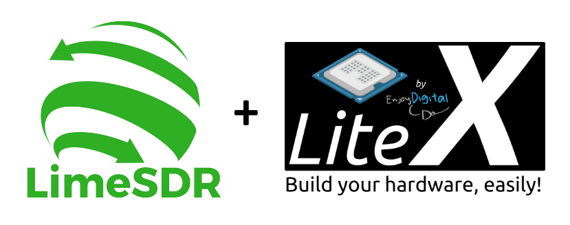

.. toctree::
   :maxdepth: 3
   :hidden:

   Introduction <self>
   docs/project_structure
   docs/gw_description
   docs/build_project
   docs/modify_project
   docs/add_new_board

Introduction
============

LimeSDR GW Project Overview
---------------------------
This project provides **gateware** and **firmware** for the LimeSDR family of boards, which are
popular for their versatility in Software Defined Radio (SDR) applications. The gateware runs on
the FPGA to handle tasks like data pipelining/processing and hardware integration, while the
firmware supports the embedded CPU for control and configuration. We tried our best to make it easy
to maintain, customize, and expand the functionality of these SDR boards.

The LimeSDR_GW repository (available on GitHub at myriadrf/LimeSDR_GW) brings LiteX and LimeDFB
together into a unified gateware ecosystem for LimeSDR variants (e.g., Mini V1/V2, XTRX). It
replaces scattered, board-specific HDL projects with a systematic, sustainable framework that
simplifies maintenance and adaptation across diverse FPGA architectures. The structure emphasizes
modularity, with board-specific configurations in platforms/targets, custom logic in gateware, and
firmware in its dedicated directory. This setup supports easy expansion, such as adding new boards
or RF features, while promoting collaboration through standardized designs.

Core Framework: LiteX
---------------------
At its core, the project is built on the **LiteX framework**, an open-source toolkit that uses
Python to describe and build System-on-Chip (SoC) designs for FPGAs. LiteX automates many of the
repetitive aspects of FPGA development, such as connecting buses, managing clocks and resets,
integrating memory, integrating CPUs, and compiling firmware. This allows developers to spend more
time on the unique parts of SDR systems, like RF signal handling, rather than getting bogged down
in low-level details.

Some key advantages include:

- Its **vendor-neutral approach**, which works across different FPGA makers like Xilinx, Altera,
  and Lattice.
- Support for various **soft-core processors** like VexRiscv.
- The ability to easily wrap and integrate existing Verilog or VHDL code.

Overall, it promotes reusability, makes designs more portable to new hardware, and fosters
collaboration through cleaner, more modular code.

RF Processing: LimeDFB
----------------------
Complementing LiteX is the **LimeDFB library**, which supplies modular VHDL components specifically
designed for RF data processing, such as receive (RX) and transmit (TX) paths tailored to the
LMS7002M transceiver found in LimeSDR boards. LimeDFB focuses on reusability (These components can
be adapted for other RF transceivers without starting from scratch) and its emphasis on
sustainability. By separating RF logic into standalone modules, it simplifies maintenance across
multiple board variants and reduces duplication.

The advantages here include:

- Easier expansion for new features or hardware changes.
- Better organization of complex RF workflows.
- A foundation that encourages community contributions to evolve SDR capabilities.

Documentation Overview
----------------------
This documentation is organized into several sections to guide you through different aspects of the
project. Here's a quick overview of the main parts and when you might want to refer to them:

**Project Structure** :doc:`docs/project_structure`
  Check this if you're new to the repository and want to understand how files and directories are
  organized, including how LiteX and LimeDFB fit together. It's helpful for getting oriented before
  diving into code or builds.

**Gateware Description** :doc:`docs/gw_description`
  Refer here for detailed explanations of the FPGA gateware for each supported board, including
  block diagrams and module breakdowns. Use it when you need to learn about the internal workings or
  troubleshoot specific hardware interactions.

**Building the Project** :doc:`docs/build_project`
  This is your go-to for instructions on compiling gateware and firmware, including required tools
  and board-specific steps. Turn to it whenever you're setting up a build environment or flashing a
  board.

**Modifying the Project** :doc:`docs/modify_project`
  If you plan to customize gateware or firmware—such as adding modules like an FFT— this section
  provides examples and guidance on where to find sources and how to make changes safely.

**Adding a New Board** :doc:`docs/add_new_board`
  Consult this if you're extending the project to support custom SDR platforms or new hardware
  variants. It walks through the process step-by-step, from repository setup to verification.

If anything remains unclear after exploring these sections, feel free to submit an issue on
GitHub—contributions and feedback are always welcome!

Supported Boards
----------------
.. table:: Table 1. Supported Boards

   +-----------------+----------------+--------------------------+---------------------------------------------------------------+
   | **Board**       | **HW Version** | **Description**          | **Toolchain**                                                 |
   +=================+================+==========================+===============================================================+
   | LimeSDR XTRX    | v1.2+          | Mini PCIe SDR board.     | Xilinx Vivado. Potential future OpenXC7 support.              |
   +-----------------+----------------+--------------------------+---------------------------------------------------------------+
   | LimeSDR Mini V1 | v1.x           | USB SDR board.           | Altera Quartus.                                               |
   +-----------------+----------------+--------------------------+---------------------------------------------------------------+
   | LimeSDR Mini V2 | v2.x           | USB SDR board.           | Open source flow with GHDL, Yosys, nextpnr.                   |
   +-----------------+----------------+--------------------------+---------------------------------------------------------------+

Open Source Tools
-----------------
The project uses open source tools for flexibility and community input. Development has been done
on **Linux**, where the tools and workflows integrate smoothly, but with some adaptations it could
potentially run on other platforms.

.. table:: Table 2. Open Source Tools

   +----------------------+------------------------------------------------------------+
   | **Tool**             | **Link**                                                   |
   +======================+============================================================+
   | GHDL                 | https://github.com/ghdl/ghdl                               |
   +----------------------+------------------------------------------------------------+
   | LiteX                | https://github.com/enjoy-digital/litex                     |
   +----------------------+------------------------------------------------------------+
   | nextpnr              | https://github.com/YosysHQ/nextpnr                         |
   +----------------------+------------------------------------------------------------+
   | prjtrellis           | https://github.com/YosysHQ/prjtrellis                      |
   +----------------------+------------------------------------------------------------+
   | OpenFPGALoader       | https://github.com/trabucayre/openFPGALoader               |
   +----------------------+------------------------------------------------------------+
   | OpenOCD              | https://openocd.org/                                       |
   +----------------------+------------------------------------------------------------+
   | VexRiscv             | https://github.com/SpinalHDL/VexRiscv                      |
   +----------------------+------------------------------------------------------------+
   | Yosys                | https://github.com/YosysHQ/yosys                           |
   +----------------------+------------------------------------------------------------+

These tools handle tasks from synthesis and simulation to debugging and programming. The project
sticks to open source where it can and should provide a good example in general of what open source
FPGA development can be done with various open source tools available!
